# spec-kit Skill

A wrapper around [spec-kit](https://github.com/github/spec-kit) (`specify` CLI) that adds the discipline needed to make Specification-Driven Development work with autonomous agents. Spec-kit gives you the workflow — this skill gives you the guardrails.

## Why this exists

Spec-kit's SDD workflow (specify → clarify → plan → tasks → implement) is powerful, but its templates are intentionally open-ended. An agent running the vanilla workflow can produce shallow specs, vague data models, and incomplete test coverage — and still technically follow the process. When those specs drive autonomous implementation via the task runner, the gaps compound: agents guess at edge cases, write inconsistent tests, over-engineer without justification, and write BLOCKED.md for problems they could solve themselves.

This skill closes those gaps by mandating minimum depth at every phase and baking enterprise-grade engineering practices into every project from day one. The result: agents produce specs that other agents can implement reliably, with fewer blocked runs, fewer wasted fix-validate cycles, and fewer surprises at integration time.

## What it adds beyond vanilla spec-kit

### Analyze phase (Phase 4) — mandatory loop

Vanilla spec-kit treats `/speckit.analyze` as optional. This skill makes it **mandatory and looping**: after clarify completes, the analyze phase runs repeatedly against the spec until it finds zero ambiguities, inconsistencies, or gaps. Only then does the workflow advance to planning. This eliminates the class of bugs where an ambiguous spec produces a plausible-but-wrong plan that agents implement faithfully.

### Auto-advance between phases

Phases auto-chain: constitution → specify → clarify → analyze loop → plan → tasks → **stop**. The agent proceeds to the next phase automatically after each completion — except Phase 7 (implement), which requires explicit user confirmation before launching the runner.

### Spec phase (Phase 2)

- **Edge case enumeration** — Every spec must include an "Edge Cases & Failure Modes" section. Without it, implementing agents encounter ambiguous situations and either guess wrong or write BLOCKED.md. With it, they have a lookup table for "what should happen when X goes wrong."
- **Idempotency requirements** — Every setup/init flow must be specified as idempotent. Agents crash, get rate-limited, and restart constantly — setup steps must be safe to re-run.
- **Functional requirement numbering** — Every requirement gets a unique `FR-xxx` ID and maps to testable success criteria (`SC-xxx`). This enables bidirectional traceability from requirement → task → test.
- **UI flow requirements** (UI projects only) — Screens, navigation, state transitions, and field validations must be specified upfront so UI_FLOW.md can be built incrementally during implementation.

### Plan phase (Phase 5)

- **Data model depth** — `data-model.md` must include entity-relationship diagrams, per-entity field tables with types/constraints, state transition rules, and cross-entity constraints. A shallow field list is not enough for agents to implement against.
- **API contract depth** — Contract docs must include full request/response schemas with concrete examples, all status codes with triggers, and wire format documentation for binary/custom protocols.
- **Architecture rationale depth** — `research.md` must document every major decision with rationale and rejected alternatives. Prevents downstream agents from undoing deliberate decisions.
- **Complexity tracking enforcement** — Any design decision that violates a constitution principle must be justified. Applies at plan time AND implementation time.
- **Phase dependency chart** — Explicit dependency graph showing which phases can run in parallel, with an optimal multi-agent strategy.
- **Readiness checks** — External dependencies must have blocking readiness scripts that agents call before proceeding.

### Enterprise-grade engineering practices

These are determined during the interview phase. The interviewer presents each topic, recommends enterprise-grade defaults, and the user decides what to implement now vs. defer. All decisions are documented — including deferrals.

- **Structured logging** — JSON-structured logs with 5 levels (DEBUG/INFO/WARN/ERROR/FATAL), correlation IDs for request tracing, and configurable destinations. Library chosen during interview.
- **Error handling** — Project-level error hierarchy with typed subclasses, error codes, HTTP status mappings, and user-facing flags. Consistent propagation pattern: throw at failure, catch at boundary, never swallow.
- **Configuration management** — Single config module with three-layer precedence (app defaults → config file → env vars), fail-fast validation at startup, and secret separation.
- **Graceful shutdown** — Signal handling, ordered cleanup (stop accepting → drain → close connections → flush logs), shutdown timeout, and verbose INFO logging at every step.
- **Health checks** — Dual endpoints (`/health` for liveness, `/ready` for readiness) with structured JSON responses including dependency status. CLI tools get `--check` flags.
- **Rate limiting & backpressure** — Per-client rate limits, bounded queues, connection limits, timeout budgets on all external calls. Deferred if user chooses, but documented.
- **Security baseline** — Secure by default, insecure by explicit informed consent. Input validation/sanitization at all boundaries (tested in CI), auth strategy, CORS, secret management, security headers, and comprehensive security scanning.
- **Observability** — Metrics emission points, trace context propagation, structured error reporting, and request/response logging (PII omitted).
- **Migration & versioning** — Idempotent up/down schema migrations, database seeding (doubles as test fixture setup), API versioning from day one with latest-version alias, and config format auto-migration.
- **CI/CD pipeline** — Working pipeline committed to the repo. Lint → build → test → security scan → deploy. Quality gates block merges. SBOM generated every run. Agentic CI feedback loop for autonomous failure diagnosis.

### Security scanning stack

Three tiers of security tooling, integrated into CI:

| Tier | Tools | Cost |
|------|-------|------|
| **Tier 1 (mandatory)** | Trivy (SCA + SBOM), OSV-Scanner v2, Semgrep (SAST), CodeQL (scheduled SAST), Gitleaks (pre-commit), TruffleHog (CI secrets), ecosystem-specific (`npm audit`, `pip audit`, etc.) | Free |
| **Tier 2 (recommended)** | Snyk (reachability analysis), Semgrep Team (cross-file), FOSSA (license compliance), SonarCloud (quality gates) | Paid |
| **Tier 3 (ecosystem)** | `eslint-plugin-security` (Node.js), `bandit` (Python), OWASP Dependency-Check (Java) | Free |

### code-review-graph — first-class knowledge graph (pinned v2.3.2)

Every spec-kit project gets a persistent tree-sitter knowledge graph wired in
at Phase 0 and kept fresh for the entire project lifetime. The graph answers
"what exists in this codebase and how does it connect" — a question `git grep`
and `rg` can't answer. Agents query it before adding new code (to avoid
duplicating existing symbols), reviewers use it for blast-radius analysis
instead of raw diffs, and the runner runs `update` at phase boundaries so
downstream agents see fresh data.

**Single source of truth**: the pinned Nix derivation lives inside this skill
at `code-review-graph/flake.nix`. Bumping v2.3.2 → v2.4.x is one edit here;
every consuming project picks it up on the next `nix develop`. No per-project
version drift possible.

**Lifecycle (what happens on `nix develop`)**:

1. **Package**: `code-review-graph` binary on PATH (built from GitHub tag
   `v2.3.2` via `buildPythonApplication`, with `pythonRelaxDeps` for upstream's
   overly-tight caret pins and overrides to skip flaky transitive tests).
2. **Auto-install, once per tool version**: the `mkShellHook` runs
   `code-review-graph install --repo $PWD --platform claude-code
   --no-instructions -y` if `.code-review-graph/installed-v<version>` is
   missing, then touches the marker. This step:
   - Merges `code-review-graph` into `.mcp.json` (preserving any existing
     servers — kanix's `mcp-android`/`mcp-browser` stay untouched)
   - Drops upstream Claude skills into `.claude/skills/` (`review-changes`,
     `explore-codebase`, `refactor-safely`, `debug-issue`)
   - Registers `PostToolUse` + `SessionStart` hooks in `.claude/settings.json`
     (PostToolUse runs `code-review-graph update --skip-flows` after every
     Edit/Write/Bash with a 30 s timeout)
   - Installs a `.git/hooks/pre-commit` hook that runs `detect-changes --brief`
   - `--no-instructions` suppresses the upstream CLAUDE.md injection so
     spec-kit's own stanza (from `code-review-graph/CLAUDE-STANZA.md`) isn't
     duplicated
3. **First build (async)**: if `.code-review-graph/graph.db` is missing, start
   `code-review-graph build` in the background. Shell returns immediately.
4. **Subsequent entries**: run `code-review-graph update` in the background
   (fast, incremental) to pick up any out-of-shell git operations.
5. **Watcher**: spawn `code-review-graph watch` in the background with a
   PID-file-gated idempotency check. Reuses any existing watcher.
6. **MCP server**: `autoInstall` has already registered `code-review-graph serve`
   in `.mcp.json`, so Claude Code spawns it on demand via stdio. The hook
   does **not** start a separate long-lived server (MCP on stdio is more
   reliable than a dangling daemon).

**Continuous refresh** — four complementary mechanisms:

| Event | Refresh mechanism | Owner |
|-------|-------------------|-------|
| File edit inside Claude session | `PostToolUse` hook runs `update --skip-flows` after Edit/Write/Bash | `.claude/settings.json` |
| File edit outside Claude (editor save, git checkout) | `code-review-graph watch` (watchdog filesystem events) | shellHook background process |
| Phase complete in runner | `_code_review_graph_update()` called before each validate-review spawn | `parallel_runner.py` |
| Shell entry | Background `update` run catches anything missed between sessions | shellHook |

**Runner integration** (`parallel_runner.py`):

- `_detect_code_review_graph()` — memoized PATH check; no-op when not installed
- `_code_review_graph_update()` — synchronous `update`, 120 s timeout, errors swallowed
- Called at the validate-review spawn point so every review agent gets a fresh graph

**Agent-facing guidance** lives in the project's `CLAUDE.md`, installed from
`code-review-graph/CLAUDE-STANZA.md` during Phase 0. Key rules:

1. Always call `get_minimal_context_tool(task="…")` first — returns ~100 tokens
   with risk, communities, flows, and suggested next tools
2. Use `detail_level="minimal"` on subsequent calls — tools default to verbose
3. Query before creating (`semantic_search_nodes_tool`, `query_graph_tool`)
4. Name real modules, not invented ones
5. Start reviews with `detect_changes_tool` / `get_review_context_tool`, not
   raw `git diff`
6. If the graph and the code disagree, trust the code but log it

**Upstream skills** the agent can invoke by name (auto-installed):

| Skill | Purpose |
|-------|---------|
| `review-changes` | Diff review with graph-backed blast radius |
| `explore-codebase` | Navigate unfamiliar areas by graph topology |
| `refactor-safely` | Walk impacted callers before editing |
| `debug-issue` | Trace bugs via dependency/flow edges |

**State directory** (`.code-review-graph/`, git-ignored):

- `graph.db` — SQLite WAL-mode knowledge graph
- `installed-v<version>` — marker file that gates the `autoInstall` step
- `build.pid` / `watch.pid` — PID files for idempotent lifecycle
- `build.log` / `watch.log` / `update.log` / `install.log` — per-phase logs

**Troubleshooting**:

- `crg-stop` shell function — kills watcher + any MCP daemon and clears PID files
- Delete `.code-review-graph/graph.db` — forces a full rebuild on next entry
- Delete `.code-review-graph/installed-v*` — forces the auto-install to re-run
- DB lock: SQLite WAL auto-recovers; only one build at a time
- Schema drift after version bump: auto-install marker re-fires on version change

**Upgrade procedure**:

1. Edit `version = "2.3.2";` in `code-review-graph/flake.nix`
2. Update the `fetchFromGitHub` `hash` (use `nix-prefetch-url --unpack --name source <tarball>`)
3. `nix flake lock --update-input code-review-graph` in every consuming project
4. Next `nix develop` picks up the new binary + re-runs `autoInstall` (marker is version-scoped)

Full reference: `reference/code-review-graph.md`.

### Implementation phase (Phase 7)

- **Integration testing** — Real servers, real processes, no mocks at system boundaries. Structured test output that agents parse. Custom test reporters.
- **Fix-validate loop** — Disk-based state machine at phase boundaries. Fresh agent per fix attempt, failure history on disk.
- **Auto-unblocking** — Agents resolve environment/tooling blockers autonomously. BLOCKED.md only for genuinely human-dependent issues.
- **UI_FLOW.md** (UI projects only) — Living reference document updated in the same commit as UI code. E2e tests reference specific sections.
- **learnings.md** — Cross-agent memory structured by task ID. Gotchas, decisions, and patterns that prevent repeated mistakes.
- **Agentic CI feedback loop** — Agent monitors CI runs, pulls failure logs, diagnoses and fixes failures, pushes again. Same fix-validate pattern applied to CI.

### Specification traceability

- **FR-xxx numbering** — Every requirement has a unique ID
- **SC-xxx success criteria** — Measurable, testable criteria mapped to requirements
- **Story-to-task traceability** — Every task references its source requirement
- **Interview handoff documents** — `interview-notes.md` + `transcript.md` for phase transitions and crash recovery
- **Auto-generated CLAUDE.md** — Project CLAUDE.md stays in sync with feature plans

## How it benefits you

| Without this skill | With this skill |
|---|---|
| Agents guess at edge cases | Edge cases enumerated in spec — agents look them up |
| Shallow data models → inconsistent implementations | ERDs + field tables + state transitions = unambiguous schema |
| API contracts say "returns JSON" | Concrete examples, all status codes, error triggers — no guessing |
| Agents over-engineer silently | Constitution violations must be justified in tracking table |
| Everything runs serially | Phase dependency chart identifies parallel workstreams |
| Agents write BLOCKED.md for installable tools | Auto-unblocking resolves environment/tooling issues |
| Test failures = raw terminal output | Structured test logs that agents parse efficiently |
| Retries corrupt state | Idempotent setup + readiness checks make retries safe |
| UI drifts from documentation | UI_FLOW.md updated in same commit as UI code |
| Each agent starts from scratch | learnings.md carries wisdom across agent contexts |
| Inconsistent logging across modules | Structured JSON logging with correlation IDs from day one |
| Error handling varies per file | Typed error hierarchy with codes, status mappings, consistent propagation |
| Config scattered as raw env var reads | Single validated config module, fail-fast on startup |
| Process dies, in-flight work lost | Graceful shutdown with ordered cleanup and verbose logging |
| No health checks until production incident | `/health` + `/ready` endpoints from the start |
| No security scanning until breach | Trivy + Semgrep + Gitleaks + TruffleHog in every CI run, SBOM on every build |
| CI breaks, human has to fix it | Agentic CI feedback loop diagnoses and fixes failures autonomously |
| No migration strategy until v2 | Idempotent up/down migrations + seed scripts from day one |
| Insecure defaults slip through | Secure by default — insecure choices require explicit informed consent |

## Architecture: lazy-loaded phases + reference files

The skill uses a **dispatcher pattern** for token efficiency. Instead of loading ~25k tokens of enterprise knowledge into every agent context, the skill loads only what's needed for the current phase.

```
SKILL.md                ← Thin dispatcher: preset selection, phase detection, routing
phases/
  install.md            ← Phase 0: install specify, init project
  interview.md          ← Phase 2: specification interview
  plan.md               ← Phase 5: architecture walkthrough and plan generation
  tasks.md              ← Phase 6: task list generation
  implement.md          ← Phase 7: runner, fix-validate loop, auto-unblocking
reference/              ← Knowledge base, loaded on demand by phase files
                          AND Read by spawned runner agents (see "Two-tier
                          prompt loading" below). Stable paths → Read-tool
                          result cache hits across spawns.
  index.md              ← Decision-tree: "if you're doing X, read Y" — the Tier-2 pointer every runner-spawned agent gets
  testing.md            ← Integration testing, structured output, stub processes
  logging.md            ← Structured logging spec
  errors.md             ← Error hierarchy, propagation
  config.md             ← Config management
  security.md           ← Security baseline, scanning tiers, headers
  shutdown.md           ← Graceful shutdown
  health.md             ← Health checks
  rate-limiting.md      ← Rate limiting & backpressure
  observability.md      ← Metrics, tracing
  migration.md          ← Migration & versioning
  cicd.md               ← CI/CD pipeline, agentic feedback loop
  nix-ci.md             ← Nix-specific CI rules (daemon flags, devshell, flake check, bwrap)
  dx.md                 ← Developer experience tooling
  ui-flow.md            ← UI_FLOW.md spec
  data-model.md         ← Data model depth
  api-contracts.md      ← External API contract depth
  interface-contracts.md← Internal contracts between tasks (file paths, formats, protocols)
  traceability.md       ← FR/SC numbering, learnings format, test plan matrix
  idempotency.md        ← Idempotency & readiness checks
  edge-cases.md         ← Edge case enumeration
  complexity.md         ← Complexity tracking
  phase-deps.md         ← Phase dependencies & parallelization
  readme.md             ← Human-facing README structure & quality checklist
  pre-pr.md             ← Pre-PR gate: single-command validation, non-vacuous checks
  e2e-runtime.md        ← Real-runtime E2E: emulator, browser, simulator patterns
  mcp-e2e.md            ← MCP-driven E2E exploration
  fix-agent-playbook.md ← General debugging heuristics for any spawned fix-agent (falsification rule, anti-patterns, claim format)
  e2e-failure-patterns.md ← Library of known platform-runtime failure signatures, matched per-attempt
  agent-file-schemas.md ← IC-AGENT-* schemas for every cross-agent file (findings.json, plan.md, handoff.md, etc.)
  verification.md       ← Completion-claim verification rules
  stripe.md             ← Stripe / payment integration reference
  code-review-graph.md  ← code-review-graph first-class integration (flake pinning, shellHook, lifecycle, runner wiring)
  cost-reporting.md     ← Cost & cache analysis for cost_report.py
code-review-graph/      ← Pinned Nix flake for code-review-graph v2.3.2 (single source of truth)
  flake.nix             ← buildPythonApplication + mkShellHook library function
  flake.lock            ← Committed lock — bumping tool version = edit flake.nix + relock
  CLAUDE-STANZA.md      ← Template stanza phases/install.md appends to the project CLAUDE.md
presets/                ← Quality presets, loaded once per project
  poc.md                ← Proof of concept
  local.md              ← Single-user local tool
  library.md            ← Published package (npm, PyPI, crates.io)
  extension.md          ← Browser / IDE extension
  public.md             ← Single-user public-facing
  enterprise.md         ← Multi-user production
parallel_runner.py      ← Task runner: parses task list, spawns parallel agents
cost_report.py          ← Post-hoc cost analyzer for run-log.jsonl (see reference/cost-reporting.md)
```

Typical savings: **60-90%** fewer tokens per phase for poc/local presets. Enterprise interview is the worst case since it loads nearly all reference files.

## Two-tier prompt loading (runner-spawned agents)

Every agent the runner spawns (`task-implementer`, `vr-fix`, `validate-review`, `services-fix`, `pre-e2e-meta-fix`, `platform-fix`, `e2e-explore`/`planner`/`executor`/`fix`/`verify`/`research`/`bug-supervisor`, `ci-diagnose`/`fix`/`local-validate`) receives the same canonical prompt skeleton:

```
{role-specific preamble}

## Required reading (Tier 1 — do these reads BEFORE planning your work)
- /abs/path/CLAUDE.md
- /abs/path/reference/<file matching the role>.md
... (2–3 files per role, hardcoded in the builder)

## Reference index (Tier 2 — read on demand)
For situations not covered above, consult /abs/path/reference/index.md.

{role-specific body, variable diagnostic content at the tail}
```

**Why this exists.** The runner spawns each agent as a fresh `claude` CLI process. The agent reads its instructions from a per-agent prompt file written by `parallel_runner.py`. That prompt file lives at a different path for each spawn (`logs/agent-N-<task>.log.prompt.md`), so **content inlined in the prompt body is NOT shared across spawns** — every spawn pays cache_create on its prompt-file Read, regardless of how byte-stable the content is. The prompt-prefix-cache strategy that works for Anthropic SDK direct callers does NOT carry over to Claude Code CLI invocations.

**What does cache.** Claude Code's Read tool result cache. When two agents Read the **same file path** with **identical file content** within the **5-minute cache TTL**, the second Read is a cache hit (priced at ~10% of fresh input). So the runner inlines no reference content; it tells each agent which reference files to Read by absolute path. Within a fix-loop (10 platform-fix attempts in 5 minutes), attempts 2..N hit cache_read on the playbook + patterns library + index, paying full cache_create only on attempt 1.

**Tier 1 — mandatory reads.** Hardcoded list per role. The agent is told it MUST Read these files first. The list is short (2–4 files) and always contains the references whose content is load-bearing for that role's evaluation criteria (e.g., `testing.md` for any role that writes or runs tests). See `_required_reads_block` in `parallel_runner.py`.

**Tier 2 — reference index.** A pointer to `reference/index.md`, which is a decision-tree table of "if you are doing X, read Y." The agent Reads `index.md` once, then Reads any cited file based on its situation. Both reads cache cross-spawn.

**Cache-correctness rules** (preserve these when adding new content to a prompt):

1. Never inline reference file content into a prompt builder's f-string. The bytes won't be cache-shared across spawns. Always pass the file path and let the agent Read.
2. The Tier-1 path list per role is a literal list at the call site. Don't generate it from runtime state (e.g., from task capabilities) unless the result is byte-stable across spawns.
3. The role string interpolated into the Tier-1 block (`f"...as the {role} agent..."`) is fine as long as the role is stable per call site (e.g., always `"e2e-fix"`).
4. Don't append per-attempt content (timestamps, attempt numbers, claim files) into the Tier-1/Tier-2 blocks — keep variable content in the role-specific tail.
5. When you add a new reference file, add a row to `reference/index.md`. When a role's mandatory references change, update the role's `_required_reads_block` call.

A determinism check (renders each builder twice with identical inputs and asserts byte-equality) lives in the audit trail; if you change a builder, run it locally with the same inputs twice and confirm the output is byte-identical.

### Agent role inventory

Every distinct agent the runner can spawn, what triggers it, and where its prompt is built. Line numbers refer to `parallel_runner.py`.

| Role | Builder | Spawned when | Purpose | Scope constraint |
|------|---------|--------------|---------|------------------|
| `task-implementer` | `build_prompt` | Per incomplete `[ ]` task in `tasks.md` | Implement one task; mark `[x]` | Source files in phase; no ROUTER.md/Skill |
| `vr-fix` | `build_vr_fix_prompt` | Validate-review report contains `VALIDATE-FAIL` | Diagnose & fix all distinct validation failures | Source in phase; cannot edit task list / validate dir |
| `validate-review` | `build_validate_review_prompt` | Phase tasks all `[x]` and not yet validated | Build/test/lint/security + code review + fix | Source in phase; writes `review-{cycle}.md` only |
| `retry` | `build_retry_prompt` | Prior attempts wrote code but crashed before completion | Verify compiles + mark task done | Read-only verify; tasks.md mark only |
| `services-fix` | `_build_services_fix_prompt` | `bash test/e2e/setup.sh` exits non-zero | Bring up Postgres/auth/API | `setup.sh`, `flake.nix`, compose, scripts/, configs only |
| `pre-e2e-meta-fix` | `_build_pre_e2e_meta_fix_prompt` | Integration-test fix loop has unproductive streak | Structural redesign of integration setup | Infra/setup only; app code off-limits |
| `platform-fix` (normal) | `_build_platform_fix_prompt` (`meta=False`) | Platform runtime (emulator/SDK/services) failed to boot | Fix runtime bringup; iterate | E2E paths: `test/e2e/`, `.dev/e2e-state/`, configs |
| `platform-fix` (meta) | same builder (`meta=True`) | Platform-fix unproductive streak threshold | Structural redesign of bringup | Broader: includes runner/wrapper, devshell, sandbox |
| `e2e-explore` | `_build_e2e_explore_prompt` | First E2E iteration or regression sweep | Sweep app, file findings | Read-only on code; writes findings/screenshots |
| `e2e-planner` | `_build_e2e_planner_prompt` | Once per iteration after explore | Order ~10–20 next-iteration steps | Writes `plan.md` only (Opus, no MCP) |
| `e2e-executor` | `_build_e2e_executor_prompt` | Multiple per iteration; Sonnet | Follow `plan.md` step-by-step | MCP + plan/findings/progress writes |
| `e2e-diagnostic` | `_build_e2e_diagnostic_prompt` | Executor wrote `blocker.md` | Decide FILE_AND_SKIP / RETRY_WITH / SKIP_SPEC_GAP | Read-only; writes `unblock-N.md` |
| `e2e-fix` | `_build_e2e_fix_prompt` | `open_bugs` non-empty after executor | Fix all bugs in one batch | Code edits + test runs + commit |
| `e2e-verify` | `_build_e2e_verify_prompt` | After fix agent | Re-test each bug; update `findings.json` status | Findings + verify-evidence only; no code |
| `e2e-supervisor` (loop) | `_build_e2e_supervisor_prompt` | After explore in each iteration | CONTINUE / REDIRECT / STOP | Writes `guidance.md` / `supervisor-decision.md` |
| `e2e-regression` | `_build_e2e_regression_prompt` | All E2E fixes committed, before declaring success | Run full project test suite | Bash + Edit (regression fixes only) |
| `e2e-crash-supervisor` | `_build_e2e_crash_supervisor_prompt` | Explore exits non-zero | Classify crash → STOP/CONTINUE | Diagnostic only |
| `e2e-research` (per-bug) | `_build_e2e_research_prompt` | Bug supervisor REDIRECT_RESEARCH | Investigate root cause; write `research-N.md` | Read-only; WebSearch enabled |
| `e2e-bug-supervisor` | `_build_e2e_bug_supervisor_prompt` | Bug has ≥1 failed fix attempt | DIRECT_FIX / REDIRECT_RESEARCH / ESCALATE | Read-only; writes supervisor-N decision/summary |
| `e2e-escalation` | `_build_e2e_escalation_prompt` | Bug supervisor ESCALATE | Synthesize `BLOCKED.md` for human | Synthesis only |
| `ci-diagnose` | `build_ci_diagnose_prompt` | CI workflow run failed | Read CI logs, write diagnosis | Read-only |
| `ci-fix` | `build_ci_fix_prompt` | After ci-diagnose | Apply fix, run fast checks, commit (no push) | Files identified by diagnosis |
| `ci-local-validate` | `build_ci_local_validate_prompt` | After ci-fix commit | Run same commands CI runs | Read-only |
| `ci-finalize` | `build_ci_finalize_prompt` | CI passes locally | Sanity check + open PR + mark done | Bash + gh + tasks.md mark |

### Per-role context matrix

What each role gets in its prompt. Tier-1 = mandatory file Reads (paths, cache cross-spawn). Tier-2 = pointer to `reference/index.md`. Inlined runtime state = per-spawn variable content embedded in the prompt body (not cached cross-spawn — keep small).

| Role | Tier-1 mandatory reads | Inlined runtime state (variable tail) | Tools |
|------|------------------------|---------------------------------------|-------|
| `task-implementer` | `CLAUDE.md`, `testing.md` | phase-filtered tasks.md block; filtered learnings; rejection / blocked-answer if any; attempt history (last 3) | Bash, Edit, MCP per `[needs:]` |
| `vr-fix` | `testing.md`, `fix-agent-playbook.md` | latest validation report; last 3 prior-failure headers | Bash, Edit |
| `validate-review` | `CLAUDE.md`, `testing.md`, `pre-pr.md` | code-review skill (cycle 1) / compact checklist (cycle 2+); prior review-N.md content; base SHA + diff range; appended hang-diagnosis files (variable tail) | Bash, Edit, MCP |
| `retry` | none | files written by prior agents; attempt # | Bash, Edit (tasks.md only) |
| `services-fix` | `fix-agent-playbook.md`, `e2e-runtime.md`, `health.md` | failure log (last 4KB) at the variable tail | Bash, Edit (infra) |
| `pre-e2e-meta-fix` | `fix-agent-playbook.md`, `e2e-failure-patterns.md`, `testing.md` | full setup.sh; env files; gate-log tail (8KB); open bugs list | Bash, Edit (infra) |
| `platform-fix` (normal/meta) | `fix-agent-playbook.md`, `e2e-failure-patterns.md` | matched signature names list; diagnostic snapshot (PATH/probes/process tree/PID/git log/setup-failure tail); fix-history repeat-section; claim files list; hypothesis brief frame | Bash, Edit (no MCP) |
| `e2e-explore` | `mcp-e2e.md`, `e2e-runtime.md` | task block; UI_FLOW.md; spec.md; guidance.md; backend env; rejection context; findings (filtered, 20KB cap, overflow → file); progress (8KB cap) | MCP (per driver), Bash (10s), Read |
| `e2e-planner` | `mcp-e2e.md` | task block; UI_FLOW.md; spec.md; findings (20KB); progress (8KB) | Read, Write (`plan.md`) |
| `e2e-executor` | `mcp-e2e.md` | UI_FLOW.md; backend env; prior handoff; unblock context | MCP (per driver), Bash, Read, Edit |
| `e2e-diagnostic` | none | blocker content; plan step; lazy-load list of prior unblocks + executor summaries | Read |
| `e2e-fix` | `fix-agent-playbook.md`, `e2e-failure-patterns.md` | per-bug research (inline if exists); supervisor decision; fix attempt history; latest verify evidence; bugs JSON; infrastructure-findings synthesis | Bash, Edit, Read, Grep, WebSearch |
| `e2e-verify` | `mcp-e2e.md` | UI_FLOW.md; findings (40KB cap, higher than explore) | MCP (per driver), Bash, Read, Edit (findings only) |
| `e2e-supervisor` (loop) | none | full state.json; findings; UI_FLOW.md | Edit |
| `e2e-regression` | none | (reads CLAUDE.md on demand) | Bash, Edit |
| `e2e-crash-supervisor` | none | full state.json; exit code; stderr; JSONL result/error | Edit |
| `e2e-research` | `fix-agent-playbook.md` | bug record; UI_FLOW.md excerpt; prior research-N.md; supervisor summaries (if redirected); fix attempts (verify-evidence excerpts up to 2KB) | Bash, Read, WebSearch |
| `e2e-bug-supervisor` | `fix-agent-playbook.md` | bug record; UI_FLOW.md; full bug history (fix_attempts); latest research; all prior supervisor summaries; pre-computed oscillation signature | Edit |
| `e2e-escalation` | none | full bug history; all supervisor summaries; latest research; category | Edit |
| `ci-diagnose` | `cicd.md`, `nix-ci.md` | CI result dict; prior diagnosis file list | Bash (read-only) |
| `ci-fix` | `CLAUDE.md`, `cicd.md`, `nix-ci.md` | latest diagnosis (inlined); prior attempt logs (last 3KB) | Bash, Edit |
| `ci-local-validate` | `.github/workflows/ci.yml`, `nix-ci.md` | prior validation tail (3KB) | Bash |
| `ci-finalize` | none (reads README.md, ci.yml, learnings on demand) | none | Bash, gh, Edit (tasks.md) |

### Cross-role handoff

How outputs flow between roles within a feature run. Files written by one role and consumed by another are the de-facto interface contract — when you change a role's output, check what reads it. Each loop is shown separately so you can follow the data flow without an exploding rendered graph.

#### Phase loop (per phase)

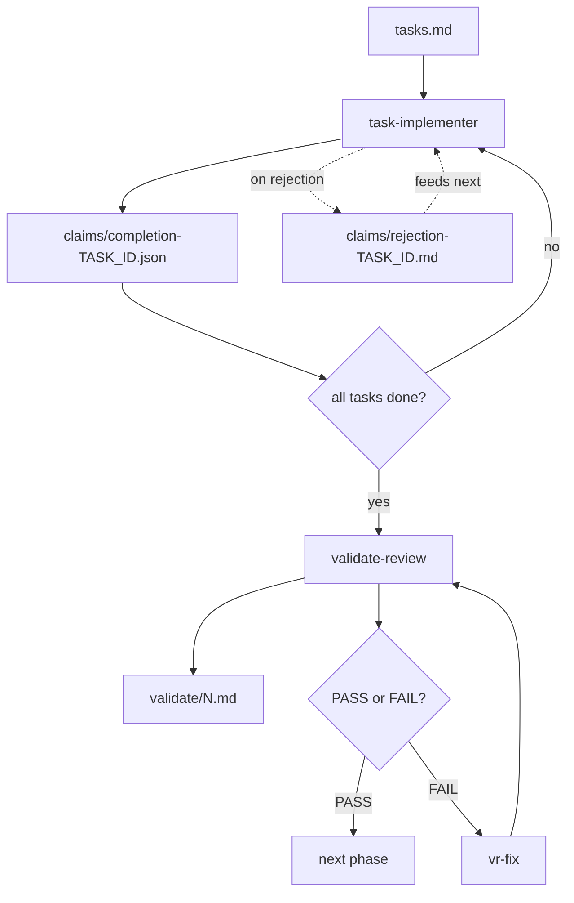

#### Pre-E2E gate (per E2E task)

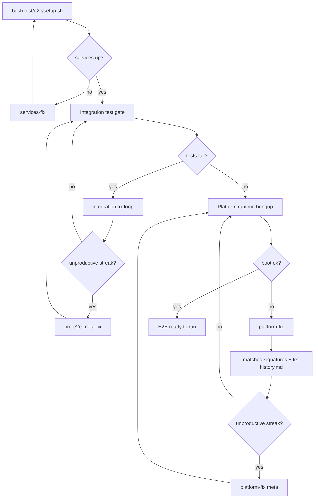

#### E2E iteration loop

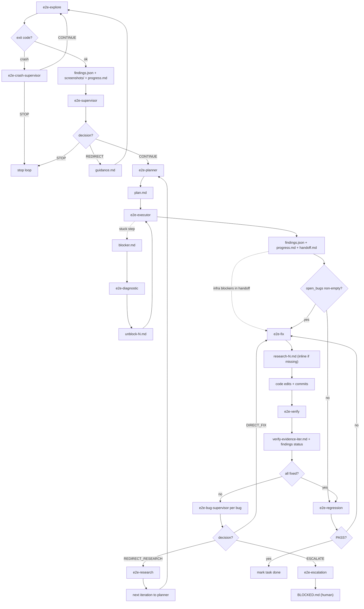

#### CI loop (per task)

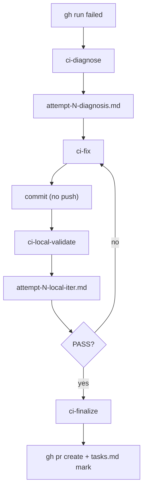

**Key contracts (file → consumer → schema):**

Every cross-agent file has a documented schema in [`reference/agent-file-schemas.md`](reference/agent-file-schemas.md). When you change a writer's output format, update the matching `IC-AGENT-*` entry in the same commit — consumers parse specific fields and anchor headings.

| File | Producer → Consumer(s) | Schema |
|------|------------------------|--------|
| `findings.json` | e2e-explore / e2e-executor / e2e-verify / e2e-fix → e2e-planner, e2e-supervisor, all E2E roles | [IC-AGENT-001](reference/agent-file-schemas.md#ic-agent-001-findingsjson) |
| `progress.md` | e2e-explore / e2e-executor → e2e-planner, e2e-supervisor | [IC-AGENT-002](reference/agent-file-schemas.md#ic-agent-002-progressmd) |
| `plan.md` | e2e-planner → e2e-executor (verbatim), e2e-diagnostic | [IC-AGENT-003](reference/agent-file-schemas.md#ic-agent-003-planmd) |
| `handoff.md` | e2e-executor → next e2e-executor; `## Infrastructure blockers` → e2e-fix | [IC-AGENT-004](reference/agent-file-schemas.md#ic-agent-004-handoffmd) |
| `blocker.md` | e2e-executor → e2e-diagnostic | [IC-AGENT-005](reference/agent-file-schemas.md#ic-agent-005-blockermd) |
| `unblock-N.md` | e2e-diagnostic → next e2e-executor spawn for that step | [IC-AGENT-006](reference/agent-file-schemas.md#ic-agent-006-unblock-nmd) |
| `research-N.md` | e2e-research / e2e-fix (inline) → e2e-fix, e2e-bug-supervisor, e2e-escalation | [IC-AGENT-007](reference/agent-file-schemas.md#ic-agent-007-research-nmd) |
| `verify-evidence-{iter}.md` | e2e-verify → e2e-fix (next attempt), e2e-bug-supervisor, e2e-research (when redirected) | [IC-AGENT-008](reference/agent-file-schemas.md#ic-agent-008-verify-evidence-itermd) |
| `supervisor-{N}-decision.md` | e2e-bug-supervisor → e2e-fix, e2e-research, future supervisor runs, e2e-escalation | [IC-AGENT-009](reference/agent-file-schemas.md#ic-agent-009-supervisor-n-decisionmd) |
| `supervisor-{N}-summary.md` | e2e-bug-supervisor → future supervisor runs, e2e-research | [IC-AGENT-010](reference/agent-file-schemas.md#ic-agent-010-supervisor-n-summarymd) |
| `guidance.md` + `supervisor-decision.md` | e2e-supervisor (loop) → e2e-explore (next iter); runner decision logic | [IC-AGENT-011](reference/agent-file-schemas.md#ic-agent-011-guidancemd--supervisor-decisionmd-loop-level) |
| `bug_history.json` | runner internal → e2e-fix, e2e-bug-supervisor, e2e-research, e2e-escalation | [IC-AGENT-012](reference/agent-file-schemas.md#ic-agent-012-bug_historyjson) |
| `fix-history.md` | runner internal → platform-fix (repeat-failure detection) | [IC-AGENT-013](reference/agent-file-schemas.md#ic-agent-013-fix-historymd) |
| `claims/completion-{TASK_ID}.json` | task-implementer / e2e-executor → runner verifier | [IC-AGENT-014](reference/agent-file-schemas.md#ic-agent-014-claimscompletion-task_idjson) |
| `claims/rejection-{TASK_ID}.md` | runner verifier → next task-implementer / e2e-explore spawn | [IC-AGENT-015](reference/agent-file-schemas.md#ic-agent-015-claimsrejection-task_idmd) |
| `claims/platform-fix-*.json` + `platform-meta-fix-*.json` | platform-fix / platform-fix-meta → runner (cross-attempt summary) | [IC-AGENT-016](reference/agent-file-schemas.md#ic-agent-016-claimsplatform-fix-json-and-claimsplatform-meta-fix-json) |
| `attempt-N-diagnosis.md` | ci-diagnose → ci-fix (inlined into prompt) | [IC-AGENT-017](reference/agent-file-schemas.md#ic-agent-017-attempt-n-diagnosismd) |
| `attempt-N-local-{iter}.md` | ci-local-validate → ci-fix (next iteration), runner (PASS/FAIL routing) | [IC-AGENT-018](reference/agent-file-schemas.md#ic-agent-018-attempt-n-local-itermd) |
| `validate/{N}.md` | validate-review → vr-fix (next cycle), runner (PASS/FAIL state) | [IC-AGENT-019](reference/agent-file-schemas.md#ic-agent-019-validatenmd-validation-report) |
| `review-{cycle}.md` | validate-review → next validate-review cycle, vr-fix (indirectly) | [IC-AGENT-020](reference/agent-file-schemas.md#ic-agent-020-review-cyclemd) |

## parallel_runner.py state machine

[parallel_runner.py](parallel_runner.py) is the orchestrator that consumes a `tasks.md`, spawns Claude CLI agents under dependency constraints, and drives the full lifecycle — scheduling, retrying, validating, reviewing, and CI/E2E debugging. This section documents its behavior as state machines. The raw diagram shows the whole system at once; the broken-down diagrams below it are scoped so a human can actually follow what's happening.

### Raw state machine (everything at once)

This is the full system in one diagram — every significant state and transition the runner can take. Useful as a reference when you need to see how layers connect; not useful for learning the system from scratch. Skip to the broken-down diagrams below if you're new to this.

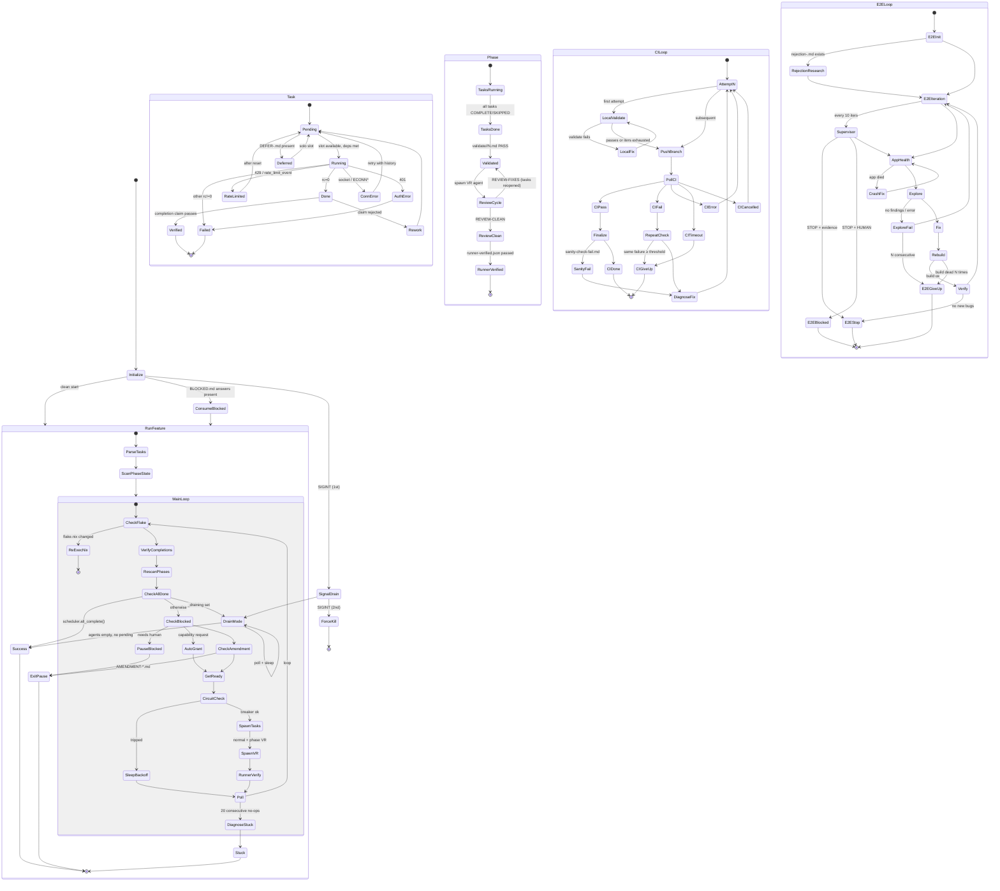

### Broken-down diagrams

The raw diagram smashes four nested machines together. Below, each machine gets its own diagram plus a stage-by-stage explanation so you can learn them in isolation.

---

#### 1. Runner lifecycle (top level)

This is the outermost loop. The runner starts up, picks a feature spec, loops scheduling and polling until all phases finish, and exits. Everything else in this document happens *inside* this loop.

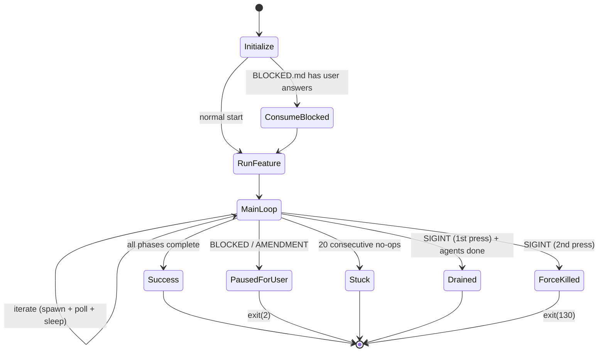

**Stages:**

- **Initialize** — parse args, detect sandbox, install signal handlers, set up pidfile. Checks `BLOCKED.md` for leftover human answers from a previous paused run.
- **ConsumeBlocked** — if the user left answers in `BLOCKED.md`, inject them into the task's attempt history so the next spawn sees them, then delete the file.
- **RunFeature** — parse `tasks.md` into phases, build the dependency graph, seed the scheduler, start the TUI.
- **MainLoop** — the core iteration: verify completions, scan phase state, check exit conditions, handle blocks, spawn ready tasks, poll running agents, sleep. Runs until a terminal state fires.
- **Success** — `scheduler.all_complete()` returns true. Clean exit.
- **PausedForUser** — a `BLOCKED.md` needing a human answer, or an `AMENDMENT-*.md` proposing a spec change. The runner stops and waits for the human to edit the file and re-run.
- **Stuck** — 20 consecutive iterations with no agents running and no agents spawned. The runner diagnoses the stuck state (prints what's blocking each phase) and exits.
- **Drained** — SIGINT was pressed once: no new spawns, wait for running agents to finish cleanly, then exit.
- **ForceKilled** — SIGINT pressed a second time: SIGTERM all agent process groups, wait briefly, SIGKILL stragglers, reap zombies, exit(130).

---

#### 2. Task lifecycle

Every individual task in `tasks.md` moves through this machine. Multiple tasks run in parallel — this diagram shows one task's path.

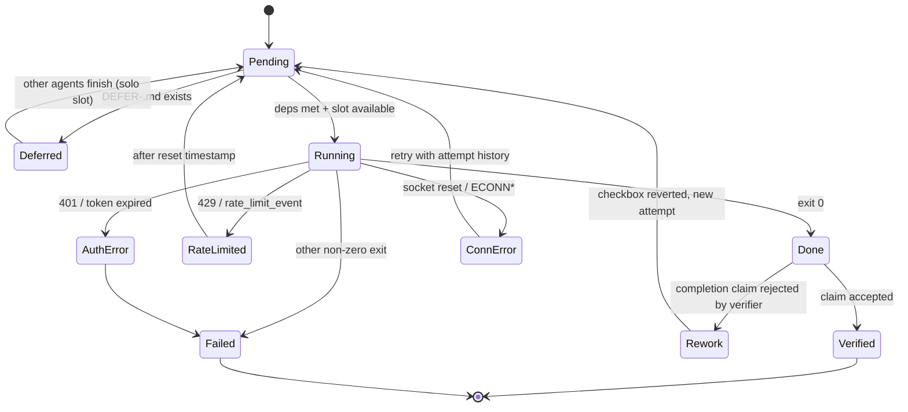

**Stages:**

- **Pending** — task is parsed from `tasks.md` with checkbox `[ ]`. Waiting for its phase deps and any sequential blockers above it in the same phase.
- **Deferred** — a prior run wrote `DEFER-<task_id>.md` (e.g. E2E task that needs solo access to the emulator). Task is skipped while other agents are running, retried when it would be the only live agent.
- **Running** — agent subprocess spawned. The runner polls its JSONL log and stderr; status transitions come from `process.poll()` plus log/stderr scanning.
- **Done** — exit code 0. Completion claim is then verified by a separate verifier agent before the checkbox stays flipped.
- **RateLimited** — detected via `rate_limit_event` in the JSONL or `429` patterns in stderr. Runner sleeps until the reset timestamp, then the task returns to Pending for a fresh attempt.
- **ConnError** — transient socket errors. Re-queued with attempt history so the next agent sees what failed.
- **AuthError** — `401` or "OAuth token expired". Not retried — the runner marks the task Failed and sets the shutdown event.
- **Failed** — all retry paths exhausted, or a non-retryable error. Task stays `[!]` in `tasks.md`.
- **Rework** — the task's completion claim was rejected by the verifier (e.g. "you said you added X but the code doesn't show it"). Checkbox is reverted, rejection report written, task goes back to Pending with the rejection in its attempt history.
- **Verified** — completion claim accepted. Task is truly done.

---

#### 3. Phase validation pipeline

Once every task in a phase is `COMPLETE` or `SKIPPED`, the phase enters a validation pipeline before being considered truly done. This gate prevents later phases from building on unchecked work.

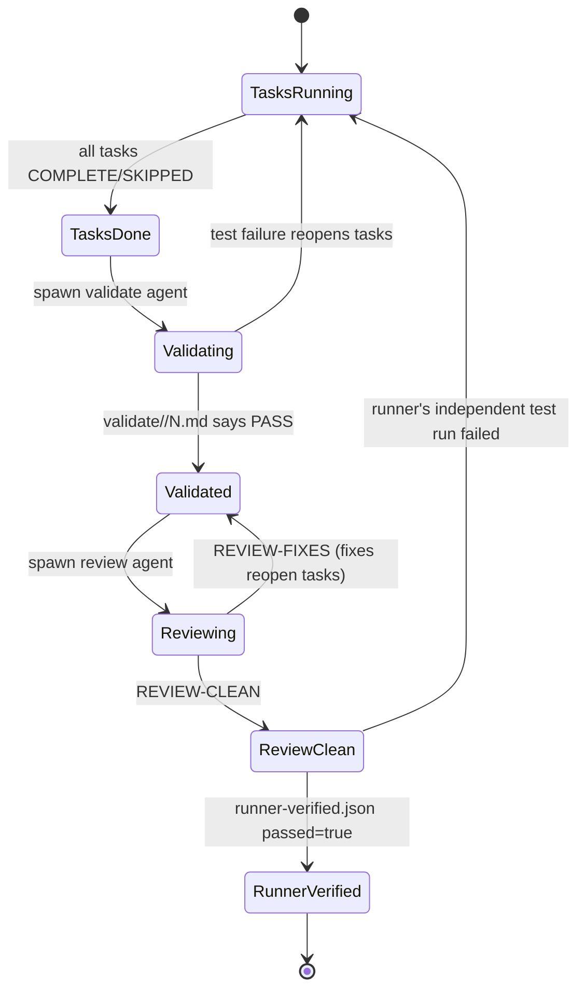

**Stages:**

- **TasksRunning** — at least one task in the phase is still Pending/Running/Failed.
- **TasksDone** — all tasks in the phase are COMPLETE or SKIPPED. Phase is eligible for validation.
- **Validating** — a validate+review sub-agent runs the phase's tests. Output lands in `validate/<phase>/N.md`. Heading must contain `PASS`.
- **Validated** — tests pass at least once (`validated=True`). Now subject to review.
- **Reviewing** — same agent (or a follow-up) reviews the phase diff for quality issues. Output: `validate/<phase>/review-N.md`. Heading is either `REVIEW-CLEAN` (nothing to fix) or `REVIEW-FIXES` (issues found → tasks reopen, phase falls back to TasksRunning).
- **ReviewClean** — latest review cycle is clean.
- **RunnerVerified** — the runner itself (not an agent) independently re-runs the discovered test commands and writes `validate/<phase>/runner-verified.json` with `passed: true`. This is the defense against an agent lying about test results. Phase is only `complete` when `validated AND review_clean AND runner_verified` are all true.

---

#### 4. CI-loop (per `[ci-loop]` task)

Tasks tagged `[ci-loop]` get a dedicated thread that drives a push → poll CI → diagnose → fix cycle until CI is green. Each attempt is persisted to `ci-debug/<task>/state.json` so the loop survives runner restarts.

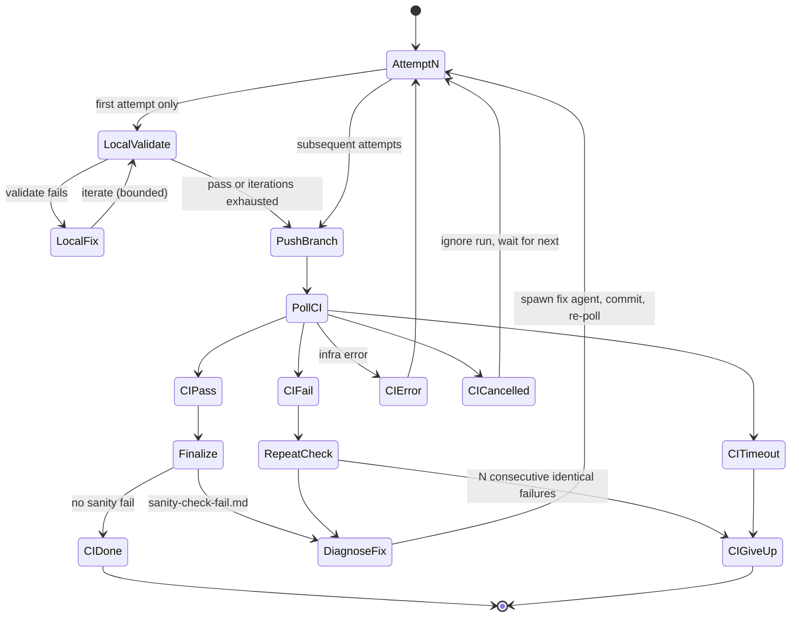

**Stages:**

- **AttemptN** — numbered attempt; state persisted after each step so crashes resume cleanly.
- **LocalValidate** — first-attempt-only: run local pre-push validation in a sub-agent before paying the cost of a CI run. Bounded iteration count.
- **LocalFix** — local validate failed; spawn fix agent, loop back to LocalValidate.
- **PushBranch** — `git push` the branch; CI picks up the new commit.
- **PollCI** — poll the CI provider for the run's result. Status is one of pass/fail/error/timeout/cancelled.
- **CIPass → Finalize** — spawn finalize sub-agent to do sanity checks (smoke tests, changelog, etc.). If it writes `sanity-check-fail.md`, treat this attempt as a failure.
- **CIFail → RepeatCheck** — if the last N attempts failed on the exact same jobs with the exact same errors, we're looping — give up rather than burn more cycles.
- **DiagnoseFix** — spawn a diagnosis sub-agent (writes `attempt-N-diagnosis.md`), then a fix sub-agent which commits the fix. Loop to AttemptN+1.
- **CIError / CICancelled** — infra issues, not code issues. Retry without blaming the code.
- **CITimeout** — poll exceeded the budget. Give up.
- **CIDone** — green build, sanity checks passed. Task is complete.
- **CIGiveUp** — repeat-failure threshold or timeout. Task ends as Failed; human intervention required.

---

#### 5. E2E-loop (per `[e2e-loop]` task)

Tasks tagged `[e2e-loop]` drive an app against a live emulator/simulator, exploring for bugs via MCP, fixing them, rebuilding, and verifying. A supervisor periodically decides whether to keep iterating.

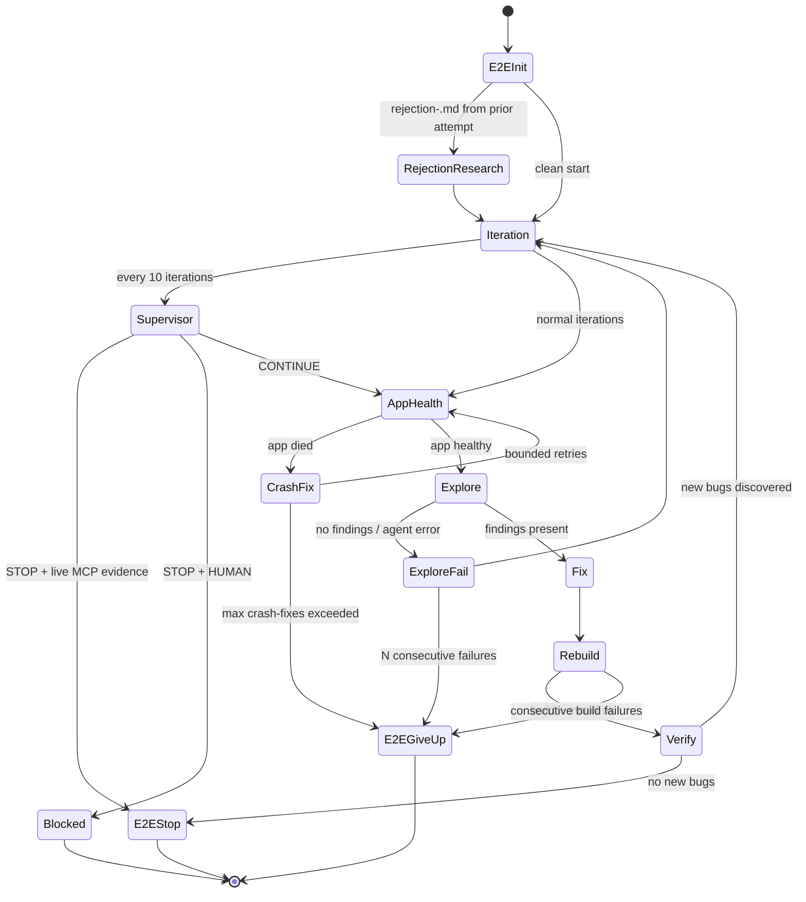

**Stages:**

- **E2EInit** — start the emulator/simulator, build and install the app, read `UI_FLOW.md` and `spec.md`, load or initialize `state.json`.
- **RejectionResearch** — if a previous run left `claims/rejection-<task_id>.md`, spawn a research sub-agent to produce `rejection-fixes.md` before re-entering the main loop.
- **Iteration** — one pass through the explore/fix/verify cycle.
- **Supervisor** — every 10 iterations, a supervisor agent decides: `CONTINUE`, `STOP` (with MCP evidence that the app actually works live), or `STOP + HUMAN` (unsafe to continue without a person). A `STOP` with no live evidence is rejected — the loop keeps going.
- **AppHealth** — launch the app and verify it's alive for a few seconds. Dead app → crash-fix sub-agent, bounded retries.
- **CrashFix** — spawn a sub-agent to fix a crash-on-launch. If we exceed the retry cap, the loop gives up.
- **Explore** — sub-agent with MCP access drives the app, produces `findings.json` listing bugs.
- **ExploreFail** — zero findings or agent error. Track consecutive failures; N in a row means we can't make progress.
- **Fix** — sub-agent (no MCP, just source edits) fixes everything in `findings.json`, commits.
- **Rebuild** — rebuild and reinstall the app. Repeated build failures end the loop.
- **Verify** — sub-agent with MCP re-tests each reported bug, classifies fixed vs still-broken, and looks for regressions. Clean run = done.
- **E2EStop** — success: verify found no new bugs or supervisor accepted STOP with evidence. Task completes, completion claim written.
- **Blocked** — supervisor asked for a human. BLOCKED.md is written and the runner pauses.
- **E2EGiveUp** — too many explore failures or build failures. Task fails.

---

#### 6. Scheduler: which tasks are ready?

Not a lifecycle, but the decision rule that feeds the Task machine. Within a phase, parallel (`[P]`) tasks can run concurrently but a sequential task blocks everything below it.

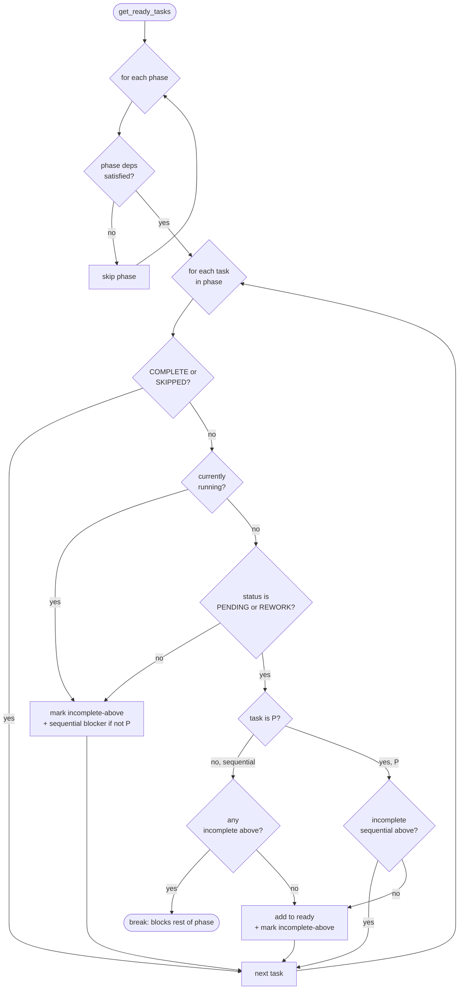

**Rules in words:**

- A **phase** is only eligible once all its declared phase-deps are complete.
- Within an eligible phase, tasks are scanned top-to-bottom.
- A **sequential** (non-`[P]`) task can only be dispatched if nothing above it is incomplete, and once dispatched it blocks everything below it in the phase.
- A **parallel** (`[P]`) task can be dispatched as long as no *sequential* task above it is still incomplete. Other parallel tasks above it don't block it.
- `COMPLETE` and `SKIPPED` tasks are treated identically (both "out of the way").
- `RUNNING` tasks count as "incomplete above" — they gate sequential tasks below but not parallel siblings.

---

#### 7. Agent exit → retry decision

When an agent process exits, the runner has to decide which state the task should move to. This is the fan-out logic:

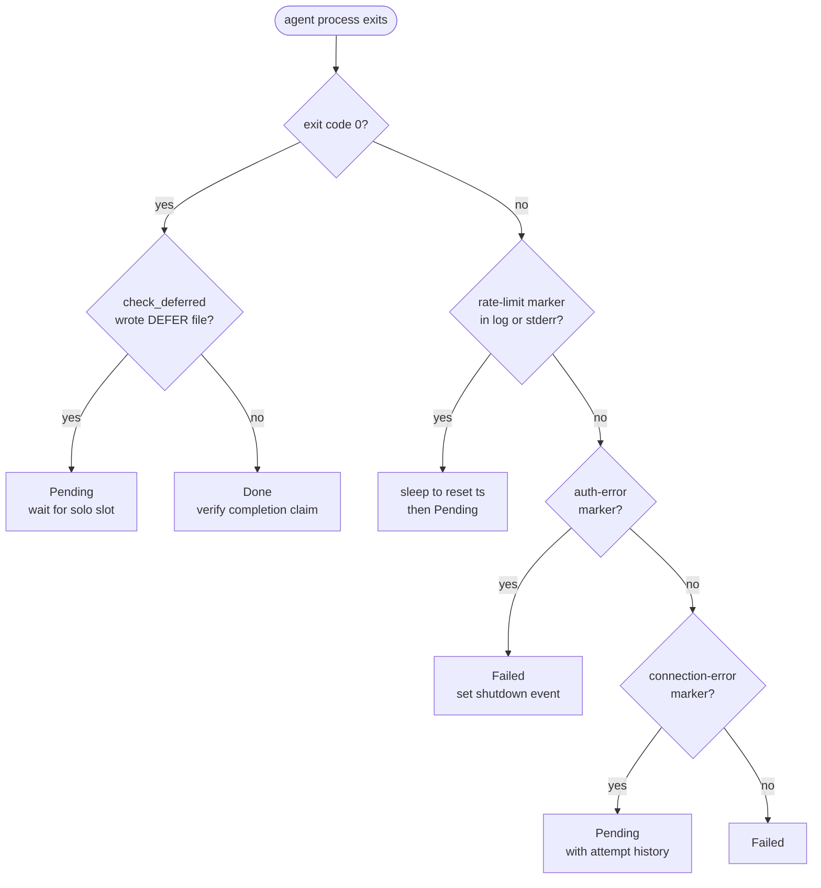

**Rules in words:**

- **Order matters.** Rate-limit is checked before auth is checked before connection errors — the first match wins.
- **`check_deferred`** runs even on success: a task can finish "successfully" but declare "I shouldn't have run concurrently — re-run me alone."
- **Auth errors are terminal for the whole runner.** They signal a credential problem that won't fix itself; the runner shuts down rather than burn retries.
- **Rate-limit retries wait for the reset timestamp** when one is provided in the error; otherwise they back off 60s.
- **Connection errors carry history forward** — the next attempt's prompt includes what just failed, so the agent can adapt.

---

## Version

Pinned to spec-kit **v0.4.1**. The skill will install this specific version and verify it on every run.
