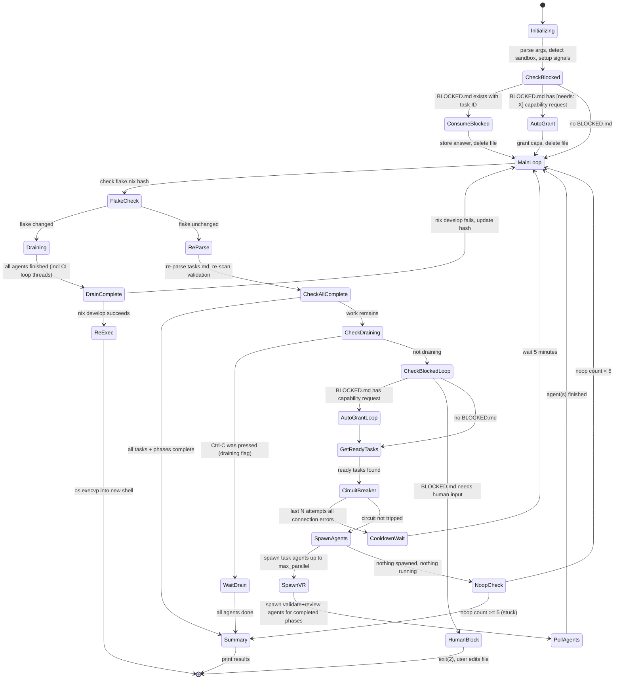
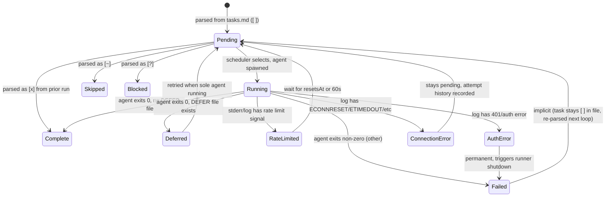
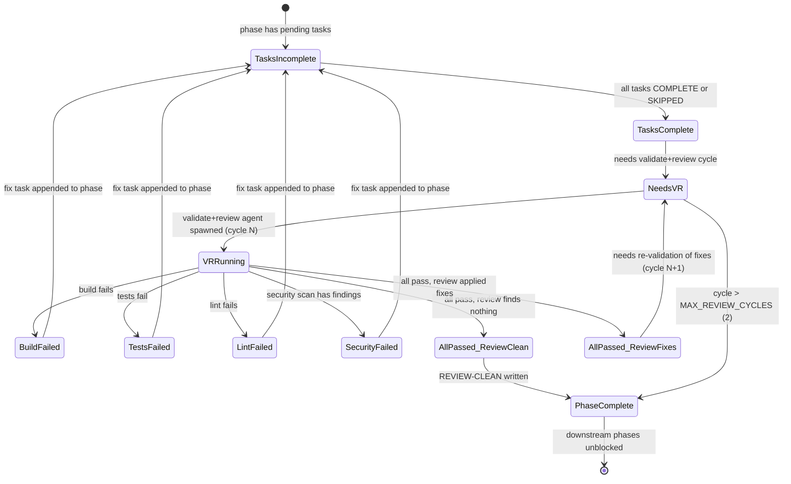
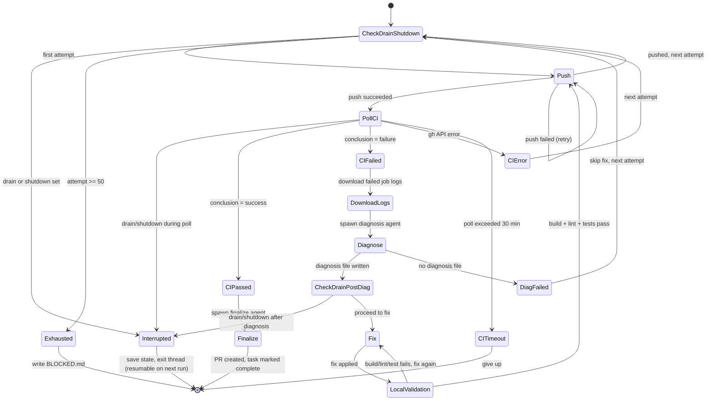
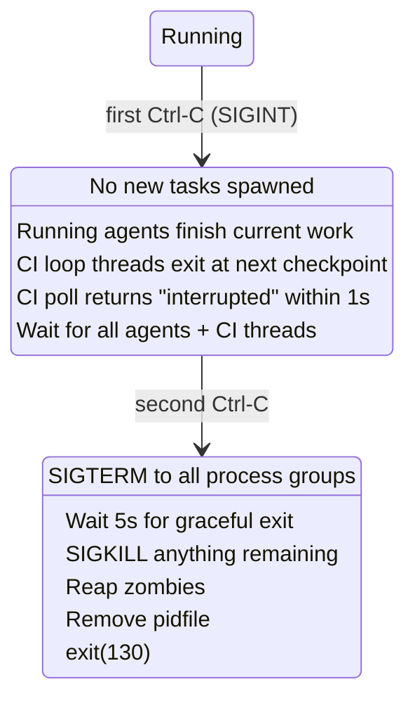

# Parallel Runner State Machine

Documentation of the state machine implemented in `parallel_runner.py` for re-implementation targeting Temporal.io.

## Overview

The parallel runner is an orchestrator that parses a `tasks.md` file into phases and tasks, then spawns Claude CLI agents in parallel (within dependency constraints) to execute each task. It manages the full lifecycle: scheduling, spawning, monitoring, retrying, validating, reviewing, and CI debugging.

---

## State Machine Layers

The runner has **four nested state machines**:

1. **Runner (top-level)** - overall orchestration lifecycle
2. **Task** - individual task execution lifecycle
3. **Phase Validation** - post-phase validate+review cycle
4. **CI Debug Loop** - runner-managed CI fix cycle for `[ci-loop]` tasks

---

## 1. Runner State Machine



### Runner State Objects (file-based)

| Object | Path | Format | Purpose |
|--------|------|--------|---------|
| PID file | `logs/runner.pid` | plaintext int | Detect/kill orphaned runners from prior crashes |
| Task file | `<spec_dir>/tasks.md` | Markdown with checkboxes | Source of truth for task status (`[ ]`, `[x]`, `[~]`, `[?]`) |
| Learnings | `<spec_dir>/learnings.md` | Markdown | Agent-written discoveries, filtered by phase when passed to agents |
| BLOCKED file | `BLOCKED.md` (project root) | Markdown | Agent writes when it needs human input; runner pauses |
| DEFER file | `DEFER-<task_id>.md` | Markdown | Agent writes when it can't complete now; runner retries when solo |
| Attempt history | `<spec_dir>/attempts/<task_id>.jsonl` | JSONL | Structured record of every agent attempt per task |
| Agent stdout log | `logs/agent-<id>-<task_id>-<ts>.jsonl` | stream-json | Claude CLI output (parsed for display, exit detection, and token usage) |
| Agent stderr log | `logs/agent-<id>-<task_id>-<ts>.stderr` | plaintext | Rate limit and error detection |
| Security scan output | `test-logs/security/<scanner>.json` | JSON | Per-scanner findings (Trivy, Semgrep, Gitleaks, govulncheck, etc.) |
| Security scan summary | `test-logs/security/summary.json` | JSON | Aggregated pass/fail + finding counts per scanner |
| Headless status | `logs/parallel-<ts>/status.txt` | plaintext | Periodic status snapshot in headless mode |
| Runner log | `logs/parallel-<ts>/runner.log` | plaintext | Timestamped runner events (headless only) |

---

## 2. Task State Machine



### Task Data Model

```python
@dataclass
class Task:
    id: str                    # e.g. "T019", "phase3-fix1"
    description: str           # from tasks.md
    phase: str                 # phase slug (e.g. "phase2-core")
    parallel: bool             # marked [P] - can run concurrently
    status: TaskStatus         # PENDING | RUNNING | COMPLETE | SKIPPED | BLOCKED | FAILED
    line_num: int              # line in tasks.md
    dependencies: list[str]    # (unused currently, reserved)
    capabilities: set[str]     # e.g. {"gh"} from [needs: gh]
```

### Agent Slot Tracking

```python
@dataclass
class AgentSlot:
    agent_id: int                        # monotonically increasing
    task: Task                           # which task this agent is working on
    process: Optional[subprocess.Popen]  # OS process handle
    pid: Optional[int]                   # OS PID
    start_time: float                    # epoch timestamp
    output_lines: list[str]              # last 200 lines of parsed output
    log_file: Optional[Path]             # path to JSONL log
    exit_code: Optional[int]             # None while running
    status: str                          # starting | running | done | failed | rate_limited
    attempt: int                         # which attempt (1 = first try)
    input_tokens: int                    # cumulative input tokens (incl cache creation + read)
    output_tokens: int                   # cumulative output tokens
```

Token counts are parsed from the `usage` field in `assistant` type stream-json messages:
- `input_tokens` = `usage.input_tokens` + `usage.cache_creation_input_tokens` + `usage.cache_read_input_tokens`
- `output_tokens` = `usage.output_tokens`

Displayed in TUI as `Xk tok` (e.g. `Agent 7: T019 (running, 180s, 245k tok)`).

### Scheduling Rules

Within a phase (once phase dependencies are met):

- **`[P]` tasks** can run concurrently with other `[P]` tasks
- **`[P]` tasks** must wait for all preceding **sequential** tasks to complete
- **Sequential tasks** (no `[P]`) must wait for ALL preceding tasks (both `[P]` and sequential)
- A sequential task **blocks everything below it** in the phase

### Retry Logic

| Condition | Action |
|-----------|--------|
| Rate limited (with `resetsAt`) | Wait until reset time + 10s buffer, then retry |
| Rate limited (no timestamp) | Wait 60s, then retry |
| Connection error | Immediate retry; attempt history passed to next agent |
| Connection error (code already written) | Lightweight retry prompt (skip context reading) |
| Auth error (401) | **Permanent failure** - runner shuts down |
| Deferred (DEFER file) | Retry only when no other agents running |
| Circuit breaker (3 consecutive connection errors in 10min) | Wait 5 minutes before any new spawns |

### Attempt Tracking

Each agent run creates a JSONL record in `<spec_dir>/attempts/<task_id>.jsonl`:

```json
{
    "agent": 7,
    "timestamp": "2026-03-29T14:30:00",
    "duration_s": 180,
    "tool_count": 42,
    "files_written": ["handler.go", "handler_test.go"],
    "files_read": ["CLAUDE.md", "spec.md"],
    "last_tool": "Bash(go test ./...)",
    "error": "",
    "progress": "wrote_code"
}
```

Progress stages: `startup` (<= 5 tools) | `reading_context` (6-15) | `exploring` (16+) | `wrote_code` (any writes)

---

## 3. Phase Validation State Machine

The validation agent runs a **four-step validation sequence**: build → test → lint → security scan. Each step must pass before the next runs. Security scans only execute after build + test + lint pass — no point scanning broken or unlinted code.



### Validation sequence (ordered, short-circuit on failure)

The validation agent runs these steps in order. If any step fails, it writes FAIL and stops — subsequent steps don't run.

| Step | Command pattern | Output location | Fails when |
|------|----------------|-----------------|------------|
| 1. Build | `go build ./...`, `npm run build`, etc. | stdout/stderr | Non-zero exit |
| 2. Test | `go test -json ./...`, `npm test`, etc. | `test-logs/<type>/<timestamp>/` | Non-zero exit or `summary.json` has failures |
| 3. Lint | `golangci-lint run`, `npm run lint`, etc. | stdout/stderr | Non-zero exit |
| 4. Security scan | `scripts/security-scan.sh` or inline scanner commands | `test-logs/security/` | `summary.json` has `"pass": false` |

The security scan step runs all project-relevant scanners (Trivy, Semgrep, Gitleaks, plus ecosystem-specific tools) with JSON output. The validation agent aggregates results into `test-logs/security/summary.json`. See `reference/security.md` for scanner commands and `reference/cicd.md` for the full integration pattern.

**Why security scans run last**: Scanners are slower than build/test/lint. Running them only after everything else passes avoids wasting 30-60s of scanner time on code that has compile errors or test failures. It also prevents false positives from scanners flagging patterns in code that's about to be rewritten by a test fix.

### Phase Validation Data Model

```python
@dataclass
class PhaseValidationState:
    validated: bool = False       # all 4 steps passed at least once
    review_cycle: int = 0         # completed review cycles
    review_clean: bool = False    # latest review found nothing

    @property
    def complete(self) -> bool:
        return self.validated and self.review_clean

    @property
    def needs_validate_review(self) -> bool:
        if not self.validated: return True
        if self.review_clean: return False
        return True  # validated but review had fixes, need re-VR
```

### Phase Validation File Objects

All stored in `<spec_dir>/validate/<phase_slug>/`:

| File Pattern | Content | Purpose |
|--------------|---------|---------|
| `<N>.md` | `# Phase <slug> - Validation #N: PASS` or `FAIL` | Validation attempt record (covers build + test + lint + security) |
| `review-<N>.md` | `# Phase <slug> - Review #N: REVIEW-CLEAN` or `REVIEW-FIXES` | Code review record |

The runner parses the **heading** of each file to determine state:
- Validation files: scan for `PASS` or `FAIL` in the first `#` heading
- Review files: scan for `REVIEW-CLEAN` or `REVIEW-FIXES` in the first `#` heading

### Validation FAIL record format (with security findings)

When validation fails due to security findings, the FAIL record includes scanner output:

```markdown
# Phase core - Validation #2: FAIL

## Step: security scan
## Exit code: 1

## Security findings summary
- semgrep: 2 findings (1 HIGH, 1 MEDIUM)
- trivy: 0 findings
- gitleaks: 0 findings

## Finding details
See test-logs/security/semgrep.json for full output.

### semgrep finding 1 (HIGH)
- Rule: go.lang.security.audit.database.string-formatted-query
- File: internal/daemon/registry.go:45
- Message: String-formatted SQL query detected. Use parameterized queries instead.

### semgrep finding 2 (MEDIUM)
- Rule: go.lang.security.audit.net.formatted-command-string
- File: internal/pairing/server.go:112
- Message: Formatted string used in command execution.
```

This structured format lets fix agents jump directly to the affected files and understand the issue without parsing raw JSON.

### Phase Dependency Resolution

Phases depend on each other via:
1. **Explicit dependency section** in tasks.md (`Phase 1 --> Phase 2`)
2. **Implicit ordering** (if no dependency section: each phase depends on the previous)
3. Phase is "complete" only when both tasks AND validation lifecycle are done
4. Downstream phases cannot start until all upstream phases are complete

---

## 4. CI Debug Loop State Machine

For tasks marked `[needs: gh, ci-loop]`, the runner manages a separate debug cycle instead of a single long-running agent. Max attempts: **50** (CI_LOOP_MAX_ATTEMPTS).

The CI loop runs in its own thread but respects the runner's drain/shutdown signals at every checkpoint: between iterations, during CI polling (1s granularity), and between the diagnose and fix sub-agent spawns.



### Fix Agent Local Validation (mandatory)

The fix agent must run local validation **before pushing**. This prevents wasting 10-30 min CI cycles on code that doesn't compile or breaks tests locally.

| Step | Command (examples) | On failure |
|------|--------------------|------------|
| Build | `go build ./...`, `npm run build`, `cargo build` | Fix before proceeding |
| Lint | `golangci-lint run`, `npm run lint`, `cargo clippy` | Fix lint errors introduced by the change |
| Unit tests | `go test -short ./...`, `npm test`, `pytest -x` | Fix if caused by the change; document and proceed if pre-existing |
| Integration tests | Project-specific (if available, < 5 min) | Skip if requires external services not available locally |

The fix agent reads `CLAUDE.md` first to determine the project's actual build/test/lint commands. Only pushes after build + lint + tests pass (or after confirming failures are pre-existing and documented in `attempt-<N>-fix-notes.md`).

### Drain/Shutdown Checkpoints in CI Loop

The CI loop checks `_draining` and `_shutdown` at these points:

| Checkpoint | What happens on drain |
|------------|----------------------|
| Top of each iteration | Loop exits, state saved (resumable) |
| During `_poll_ci_run` | Polling uses 1s sleep increments; checks stop_event each second, returns `{"status": "interrupted"}` |
| Between diagnose and fix agents | Loop exits after diagnosis completes, before spawning fix agent |

The state file (`ci-debug/<task_id>/state.json`) records the attempt number, so the loop resumes from where it left off on the next runner invocation.

### CI Debug File Objects

All stored in `ci-debug/<task_id>/`:

| File | Format | Purpose |
|------|--------|---------|
| `state.json` | JSON | Resumable state: branch, attempt history |
| `attempt-<N>-logs.txt` | plaintext | Downloaded CI failure logs |
| `attempt-<N>-ci-result.json` | JSON | CI run result (status, conclusion, failed jobs, URL) |
| `attempt-<N>-diagnosis.md` | Markdown | Diagnosis agent output (root cause, recommended fix) |
| `attempt-<N>-fix-notes.md` | Markdown | Optional: fix agent's reasoning when disagreeing with diagnosis |
| `ci-loop.log` | plaintext | Timestamped CI loop event log |

### CI State File Schema

```json
{
    "task_id": "T075",
    "branch": "develop",
    "attempts": [
        {
            "attempt": 1,
            "started": "2026-03-29T14:00:00",
            "status": "fix_applied",
            "ci_result": {
                "status": "fail",
                "run_id": 12345,
                "conclusion": "failure",
                "url": "https://github.com/...",
                "failed_jobs": ["lint", "test"]
            }
        }
    ]
}
```

### CI Attempt Status Values

| Status | Meaning |
|--------|---------|
| `fix_applied` | Diagnosis + fix completed, pushed, looping back to poll |
| `pass` | CI passed, finalize agent will run |
| `push_failed` | Git push failed |
| `diag_failed` | Diagnosis agent didn't produce a diagnosis file |
| `error` | GitHub API error during polling |
| `timeout` | CI poll exceeded 30 min timeout |
| `interrupted` | Drain/shutdown requested during CI polling |
| `interrupted_after_diag` | Drain/shutdown requested between diagnose and fix |

---

## 5. Agent Spawning and Sandbox

### Sandbox (bubblewrap)

When enabled, each agent runs inside a `bwrap` filesystem sandbox:

| Mount | Mode | Purpose |
|-------|------|---------|
| `/nix/store` | read-only | All binaries, libraries, CLI tools |
| project directory | **read-write** | The ONLY writable surface |
| `/dev`, `/proc` | read-only | Required by processes |
| `/tmp` | tmpfs | Scratch space (ephemeral) |
| `~/.gitconfig` | read-only | Git author name/email |
| `/etc/resolv.conf`, `/etc/hosts` | read-only | DNS resolution |
| `/etc/ssl/certs` | read-only | TLS certificates |
| `~/.claude/.credentials.json` | read-only | Claude CLI OAuth token |
| Everything else | **not mounted** | No home dir, no SSH keys, no cloud creds |

### Capability-Gated Credentials

| Capability | Credential | How Injected | Security Restriction |
|------------|-----------|--------------|---------------------|
| `gh` | `GH_TOKEN` | env var via `Popen(env=)` | **Stripped** if task description contains package install commands |

---

## 6. Signal Handling



---

## Key Design Decisions for Temporal Migration

1. **File-based state**: All state is persisted to the filesystem (tasks.md checkboxes, JSONL attempt logs, validation markdown files). Temporal replaces this with workflow state.

2. **Polling loop**: The runner polls agents every 1s and re-parses tasks.md every iteration. Temporal activities + signals replace this.

3. **Phase validation is a nested workflow**: Tasks complete -> validate+review(1) -> potentially validate+review(2) -> phase complete. This maps to a child workflow.

4. **CI debug loop is a separate workflow**: Push -> poll CI -> diagnose -> fix -> repeat. Maps to a long-running child workflow with heartbeats. The drain-awareness (stop_event propagation, checkpoint checks) maps to Temporal's cancellation scopes and activity heartbeats.

5. **Concurrency control**: `max_parallel` slots with priority given to task agents over VR agents. Maps to Temporal's workflow-level semaphores or task queue rate limiting.

6. **Circuit breaker**: Pauses all spawning when N consecutive connection errors occur. Maps to a Temporal timer + side effect.

7. **Retry with history**: Failed agents' attempt summaries are passed to the next agent. Maps to activity retry with custom context.

8. **Flake re-exec**: When `flake.nix` changes, the runner drains and re-execs into the new Nix shell. In Temporal, this would be a worker restart with the new environment.

9. **Graceful drain**: First Ctrl-C stops new work, second kills everything. CI loop threads respond to drain within 1s via stop_event polling. Maps to Temporal's cancellation scopes.

10. **Token tracking**: Input/output tokens parsed from stream-json `usage` fields on each assistant message. Displayed in TUI for cost visibility. In Temporal, this becomes workflow metadata/memo for observability dashboards.

11. **CI loop resumability**: State persisted to `state.json` with attempt count, so interrupted loops resume on next run. In Temporal, this is inherent — the workflow picks up from where it left off after worker restart.

12. **Security scan in validation**: Phase validation runs build → test → lint → security scan in order, short-circuiting on first failure category. Security scanners (Trivy, Semgrep, Gitleaks, ecosystem-specific tools) produce JSON to `test-logs/security/` — same structured output pattern as test failures. Security findings trigger the same fix-validate loop as test failures: fix task appended, fresh fix agent reads findings, patches code, re-validate. This means security issues are caught and fixed locally before any push, avoiding wasted CI cycles. In Temporal, security scanning is an additional activity in the phase validation child workflow.
