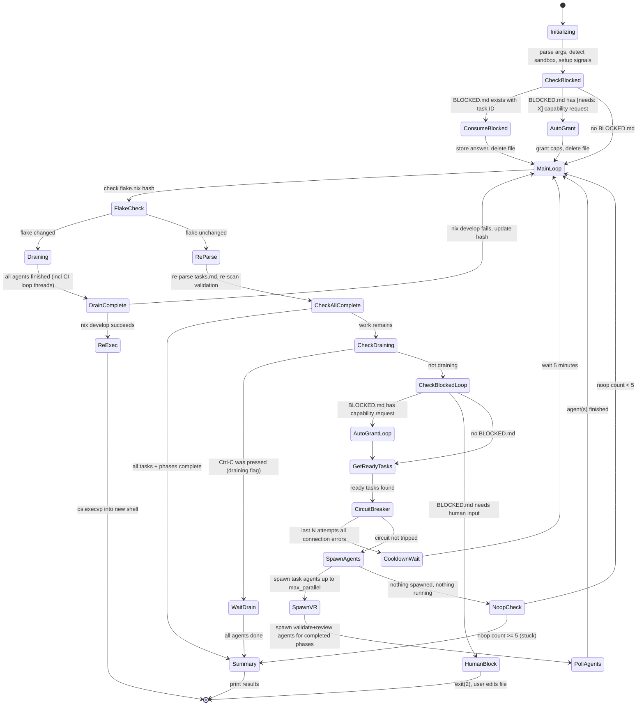
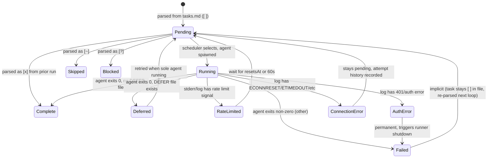
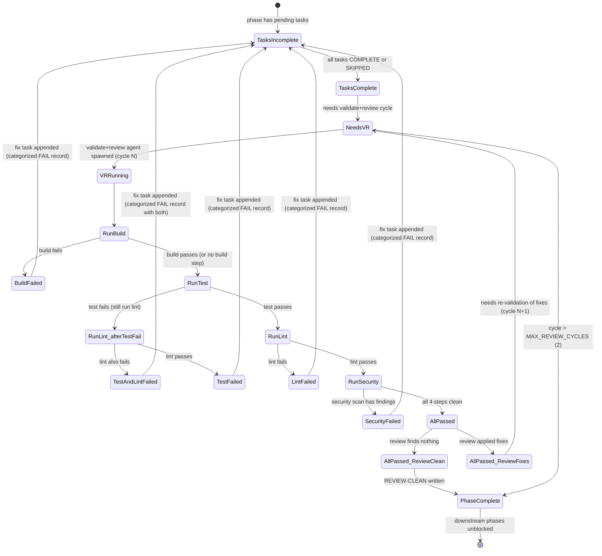
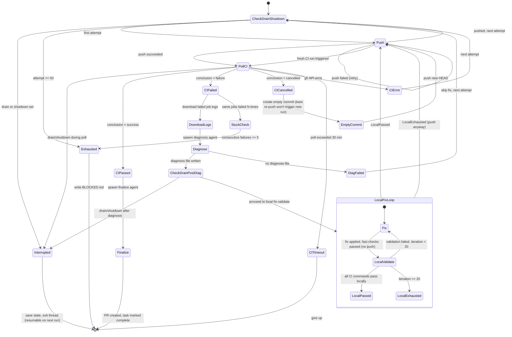
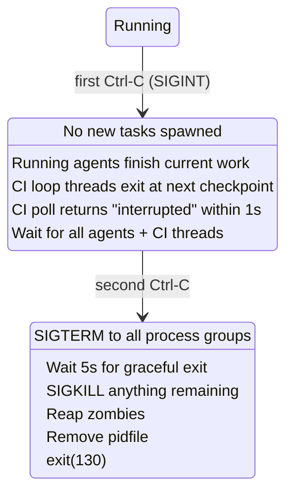

# Parallel Runner State Machine

Documentation of the state machine implemented in `parallel_runner.py` for re-implementation targeting Temporal.io.

## Overview

The parallel runner is an orchestrator that parses a `tasks.md` file into phases and tasks, then spawns Claude CLI agents in parallel (within dependency constraints) to execute each task. It manages the full lifecycle: scheduling, spawning, monitoring, retrying, validating, reviewing, and CI debugging.

---

## State Machine Layers

The runner has **four nested state machines**:

1. **Runner (top-level)** - overall orchestration lifecycle
2. **Task** - individual task execution lifecycle
3. **Phase Validation** - post-phase validate+review cycle
4. **CI Debug Loop** - runner-managed CI fix cycle for `[ci-loop]` tasks

---

## 1. Runner State Machine



### Runner State Objects (file-based)

| Object | Path | Format | Purpose |
|--------|------|--------|---------|
| PID file | `logs/runner.pid` | plaintext int | Detect/kill orphaned runners from prior crashes |
| Task file | `<spec_dir>/tasks.md` | Markdown with checkboxes | Source of truth for task status (`[ ]`, `[x]`, `[~]`, `[?]`) |
| Learnings | `<spec_dir>/learnings.md` | Markdown | Agent-written discoveries, filtered by phase when passed to agents |
| BLOCKED file | `BLOCKED.md` (project root) | Markdown | Agent writes when it needs human input; runner pauses |
| DEFER file | `DEFER-<task_id>.md` | Markdown | Agent writes when it can't complete now; runner retries when solo |
| Attempt history | `<spec_dir>/attempts/<task_id>.jsonl` | JSONL | Structured record of every agent attempt per task |
| Agent stdout log | `logs/agent-<id>-<task_id>-<ts>.jsonl` | stream-json | Claude CLI output (parsed for display, exit detection, and token usage) |
| Agent stderr log | `logs/agent-<id>-<task_id>-<ts>.stderr` | plaintext | Rate limit and error detection |
| Security scan output | `test-logs/security/<scanner>.json` | JSON | Per-scanner findings (Trivy, Semgrep, Gitleaks, govulncheck, etc.) |
| Security scan summary | `test-logs/security/summary.json` | JSON | Aggregated pass/fail + finding counts per scanner |
| Headless status | `logs/parallel-<ts>/status.txt` | plaintext | Periodic status snapshot in headless mode |
| Runner log | `logs/parallel-<ts>/runner.log` | plaintext | Timestamped runner events (headless only) |

---

## 2. Task State Machine



### Task Data Model

```python
@dataclass
class Task:
    id: str                    # e.g. "T019", "phase3-fix1"
    description: str           # from tasks.md
    phase: str                 # phase slug (e.g. "phase2-core")
    parallel: bool             # marked [P] - can run concurrently
    status: TaskStatus         # PENDING | RUNNING | COMPLETE | SKIPPED | BLOCKED | FAILED
    line_num: int              # line in tasks.md
    dependencies: list[str]    # (unused currently, reserved)
    capabilities: set[str]     # e.g. {"gh"} from [needs: gh]
```

### Agent Slot Tracking

```python
@dataclass
class AgentSlot:
    agent_id: int                        # monotonically increasing
    task: Task                           # which task this agent is working on
    process: Optional[subprocess.Popen]  # OS process handle
    pid: Optional[int]                   # OS PID
    start_time: float                    # epoch timestamp
    output_lines: list[str]              # last 200 lines of parsed output
    log_file: Optional[Path]             # path to JSONL log
    exit_code: Optional[int]             # None while running
    status: str                          # starting | running | done | failed | rate_limited
    attempt: int                         # which attempt (1 = first try)
    input_tokens: int                    # cumulative input tokens (incl cache creation + read)
    output_tokens: int                   # cumulative output tokens
```

Token counts are parsed from the `usage` field in `assistant` type stream-json messages:
- `input_tokens` = `usage.input_tokens` + `usage.cache_creation_input_tokens` + `usage.cache_read_input_tokens`
- `output_tokens` = `usage.output_tokens`

Displayed in TUI as `Xk tok` (e.g. `Agent 7: T019 (running, 180s, 245k tok)`).

### Scheduling Rules

Within a phase (once phase dependencies are met):

- **`[P]` tasks** can run concurrently with other `[P]` tasks
- **`[P]` tasks** must wait for all preceding **sequential** tasks to complete
- **Sequential tasks** (no `[P]`) must wait for ALL preceding tasks (both `[P]` and sequential)
- A sequential task **blocks everything below it** in the phase

### Retry Logic

| Condition | Action |
|-----------|--------|
| Rate limited (with `resetsAt`) | Wait until reset time + 10s buffer, then retry |
| Rate limited (no timestamp) | Wait 60s, then retry |
| Connection error | Immediate retry; attempt history passed to next agent |
| Connection error (code already written) | Lightweight retry prompt (skip context reading) |
| Auth error (401) | **Permanent failure** - runner shuts down |
| Deferred (DEFER file) | Retry only when no other agents running |
| Circuit breaker (3 consecutive connection errors in 10min) | Wait 5 minutes before any new spawns |

### Attempt Tracking

Each agent run creates a JSONL record in `<spec_dir>/attempts/<task_id>.jsonl`:

```json
{
    "agent": 7,
    "timestamp": "2026-03-29T14:30:00",
    "duration_s": 180,
    "tool_count": 42,
    "files_written": ["handler.go", "handler_test.go"],
    "files_read": ["CLAUDE.md", "spec.md"],
    "last_tool": "Bash(go test ./...)",
    "error": "",
    "progress": "wrote_code"
}
```

Progress stages: `startup` (<= 5 tools) | `reading_context` (6-15) | `exploring` (16+) | `wrote_code` (any writes)

---

## 3. Phase Validation State Machine

The validation agent runs a **four-step validation sequence**: build → test → lint → security scan. Build failure short-circuits everything. Test failure still runs lint (so the fix agent gets both sets of errors in one pass). Security scans only run after build + test + lint all pass.



### Validation sequence (ordered, with short-circuit rules)

The validation agent runs these steps in order with the following short-circuit rules:
- **Build fails** → skip test, lint, security (nothing else is meaningful)
- **Test fails** → still run lint (cheap, gives fix agent both error sets in one pass) → skip security
- **Lint fails** (tests passed) → skip security
- **Security fails** → write FAIL, done

| Step | Command pattern | Output location | Fails when |
|------|----------------|-----------------|------------|
| 1. Build | `go build ./...`, `npm run build`, etc. | stdout/stderr | Non-zero exit |
| 2. Test | `go test -json ./...`, `npm test`, etc. | `test-logs/<type>/<timestamp>/` | Non-zero exit or `summary.json` has failures |
| 3. Lint | `golangci-lint run`, `npm run lint`, etc. | stdout/stderr | Non-zero exit |
| 4. Security scan | `scripts/security-scan.sh` or inline scanner commands | `test-logs/security/` | `summary.json` has `"pass": false` |

The security scan step runs all project-relevant scanners (Trivy, Semgrep, Gitleaks, plus ecosystem-specific tools) with JSON output. The validation agent aggregates results into `test-logs/security/summary.json`. See `reference/security.md` for scanner commands and `reference/cicd.md` for the full integration pattern.

**Why security scans run last**: Scanners are slower than build/test/lint. Running them only after everything else passes avoids wasting 30-60s of scanner time on code that has compile errors or test failures. It also prevents false positives from scanners flagging patterns in code that's about to be rewritten by a test fix.

### Phase Validation Data Model

```python
@dataclass
class PhaseValidationState:
    validated: bool = False       # all 4 steps passed at least once
    review_cycle: int = 0         # completed review cycles
    review_clean: bool = False    # latest review found nothing

    @property
    def complete(self) -> bool:
        return self.validated and self.review_clean

    @property
    def needs_validate_review(self) -> bool:
        if not self.validated: return True
        if self.review_clean: return False
        return True  # validated but review had fixes, need re-VR
```

### Phase Validation File Objects

All stored in `<spec_dir>/validate/<phase_slug>/`:

| File Pattern | Content | Purpose |
|--------------|---------|---------|
| `<N>.md` | `# Phase <slug> - Validation #N: PASS` or `FAIL` | Validation attempt record (covers build + test + lint + security) |
| `review-<N>.md` | `# Phase <slug> - Review #N: REVIEW-CLEAN` or `REVIEW-FIXES` | Code review record |

The runner parses the **heading** of each file to determine state:
- Validation files: scan for `PASS` or `FAIL` in the first `#` heading
- Review files: scan for `REVIEW-CLEAN` or `REVIEW-FIXES` in the first `#` heading

### Validation FAIL record format (categorized)

Every FAIL record starts with a **failure categories** summary so fix agents can immediately see which steps failed without parsing raw output. The fix agent reads the latest record first, checks prior FAIL records to avoid repeating failed approaches, then runs build+test+lint locally before marking complete.

**Example: test + lint both failed (test failure triggered lint to still run)**

```markdown
# Phase core — Validation #2: FAIL

**Date**: 2026-03-29T14:30:00Z

## Failure categories
- **Build**: PASS
- **Test**: FAIL (12 passed, 2 failed, 0 skipped)
- **Lint**: FAIL (3 errors, 1 warning)
- **Security**: SKIPPED

## Failed steps detail

### Test
**Command**: `go test -json ./...`
**Exit code**: 1
**Root cause summary**: Two handler tests fail because the new middleware changes the context key name but the handlers still read the old key.
**Failures**:
- `internal/daemon/registry_test.go:45` — TestRegisterDevice: expected device ID in context, got nil
- `internal/daemon/registry_test.go:78` — TestDeregisterDevice: expected auth token in context, got nil

### Lint
**Command**: `golangci-lint run`
**Exit code**: 1
**Root cause summary**: Unused parameter and missing error check introduced in the middleware refactor.
**Failures**:
- `internal/agent/handler.go:23` — `unused-parameter: 'ctx' is unused` (the new middleware passes context but handler ignores it)
- `internal/pairing/server.go:112` — `errcheck: error return value not checked`
- `internal/pairing/server.go:118` — `errcheck: error return value not checked`

## Full output
(relevant portions of stdout/stderr, organized by step)
```

**Example: security scan failed**

```markdown
# Phase core — Validation #3: FAIL

**Date**: 2026-03-29T15:00:00Z

## Failure categories
- **Build**: PASS
- **Test**: PASS (14 passed, 0 failed, 0 skipped)
- **Lint**: PASS (0 errors, 0 warnings)
- **Security**: FAIL (2 findings)

## Failed steps detail

### Security
**Command**: `semgrep --config auto --json -o test-logs/security/semgrep.json .`
**Exit code**: 1
**Root cause summary**: SQL injection via string formatting and unsafe command execution.
**Failures**:
- `internal/daemon/registry.go:45` — semgrep HIGH: go.lang.security.audit.database.string-formatted-query — Use parameterized queries instead
- `internal/pairing/server.go:112` — semgrep MEDIUM: go.lang.security.audit.net.formatted-command-string — Formatted string used in command execution

See `test-logs/security/semgrep.json` for full scanner output.

## Full output
(relevant portions of stdout/stderr, organized by step)
```

This categorized format lets fix agents: (1) immediately see which steps failed, (2) read root cause summaries before diving into raw output, (3) address all failure categories in a single pass.

### Phase Dependency Resolution

Phases depend on each other via:
1. **Explicit dependency section** in tasks.md (`Phase 1 --> Phase 2`)
2. **Implicit ordering** (if no dependency section: each phase depends on the previous)
3. Phase is "complete" only when both tasks AND validation lifecycle are done
4. Downstream phases cannot start until all upstream phases are complete

---

## 4. CI Debug Loop State Machine

For tasks marked `[needs: gh, ci-loop]`, the runner manages a separate debug cycle instead of a single long-running agent. Max attempts: **50** (CI_LOOP_MAX_ATTEMPTS).

The CI loop runs in its own thread but respects the runner's drain/shutdown signals at every checkpoint: between iterations, during CI polling (1s granularity), and between the diagnose and fix sub-agent spawns.



### Runner-Managed Local Fix-Validate Loop (mandatory)

The runner manages a **structured fix-validate loop** before pushing. The fix and validation agents have distinct responsibilities — the fix agent handles quick checks, and the validation agent runs the full suite including slow commands. Up to **20 local iterations** (`CI_LOCAL_MAX_ITERATIONS`).

| Agent | Job | Runs slow commands? | Pushes? |
|-------|-----|---------------------|---------|
| **Fix agent** | Reads diagnosis/validation result, applies fix, runs **fast checks only** (lint, build, unit tests with `-short`). Up to 3 quick iterations internally. Commits. | NO | NO |
| **Validation agent** | Runs the SAME commands CI runs locally (including slow ones: VM tests, E2E, `nix flake check`), writes structured PASS/FAIL result. | YES | NO |
| **Runner** | Checks validation result. If PASS → push. If FAIL → spawn fix agent again. | N/A | YES (only after PASS) |

#### Why the split?

Slow commands (NixOS VM tests, Docker E2E) take 10-20 minutes. If the fix agent runs these in its own inner loop, a single fix agent can burn hours. By limiting the fix agent to fast checks (<60s) and letting the validate agent handle slow commands, each cycle is: ~2 min fix + ~15 min validate = ~17 min total, with clean context separation.

#### CI parity: validation commands are derived from the CI workflow

The validation agent reads `.github/workflows/ci.yml` to discover commands, rather than using a hardcoded list. It runs every `run:` command from the CI workflow, skipping only GitHub Actions-specific steps (checkout, artifact upload, SARIF upload) and steps gated on CI-only secrets. This ensures local validation catches the same failures CI would, including:

- NixOS VM tests (`nix flake check --print-build-logs`)
- Full test suites (not just `-short`)
- Linters, formatters, and static analysis

#### Repeated failure early exit

If the same CI jobs fail **5 consecutive times** (`CI_REPEAT_FAILURE_THRESHOLD`), the loop stops and writes `BLOCKED.md` instead of continuing to burn tokens on a problem the automated loop can't solve. Cancelled and interrupted runs are skipped when counting consecutive failures.

#### Validation result file format

Each validation iteration writes `attempt-<N>-local-<iter>.md` with:
- `## Result: PASS` or `## Result: FAIL`
- A table of every command run with exit codes
- Detailed failure output for each failed command

The runner parses the `## Result:` heading to decide whether to push or loop.

#### What happens after 20 local iterations

If validation still fails after 20 iterations, the runner pushes anyway and lets CI catch remaining issues. The attempt is recorded as `fix_applied_local_incomplete` so the diagnosis agent on the next CI failure knows local validation was exhausted.

### Drain/Shutdown Checkpoints in CI Loop

The CI loop checks `_draining` and `_shutdown` at these points:

| Checkpoint | What happens on drain |
|------------|----------------------|
| Top of each iteration | Loop exits, state saved (resumable) |
| During `_poll_ci_run` | Polling uses 1s sleep increments; checks stop_event each second, returns `{"status": "interrupted"}` |
| Between diagnose and fix agents | Loop exits after diagnosis completes, before spawning fix agent |

The state file (`ci-debug/<task_id>/state.json`) records the attempt number, so the loop resumes from where it left off on the next runner invocation.

### CI Debug File Objects

All stored in `ci-debug/<task_id>/`:

| File | Format | Purpose |
|------|--------|---------|
| `state.json` | JSON | Resumable state: branch, attempt history |
| `attempt-<N>-logs.txt` | plaintext | Downloaded CI failure logs |
| `attempt-<N>-ci-result.json` | JSON | CI run result (status, conclusion, failed jobs, URL) |
| `attempt-<N>-diagnosis.md` | Markdown | Diagnosis agent output (root cause, recommended fix) |
| `attempt-<N>-fix-notes.md` | Markdown | Optional: fix agent's reasoning when disagreeing with diagnosis |
| `attempt-<N>-local-<M>.md` | Markdown | Local validation result for CI attempt N, local iteration M (PASS/FAIL + command table) |
| `ci-loop.log` | plaintext | Timestamped CI loop event log |

### CI State File Schema

```json
{
    "task_id": "T075",
    "branch": "develop",
    "attempts": [
        {
            "attempt": 1,
            "started": "2026-03-29T14:00:00",
            "status": "fix_applied",
            "ci_result": {
                "status": "fail",
                "run_id": 12345,
                "conclusion": "failure",
                "url": "https://github.com/...",
                "failed_jobs": ["lint", "test"]
            }
        }
    ]
}
```

### CI Attempt Status Values

| Status | Meaning |
|--------|---------|
| `fix_applied` | Diagnosis + local fix-validate loop passed, pushed, looping back to poll |
| `fix_applied_local_incomplete` | Local validation failed after 20 iterations, pushed anyway |
| `pass` | CI passed, finalize agent will run |
| `push_failed` | Git push failed |
| `push_failed_after_local` | Local validation passed but push failed |
| `cancelled` | CI run was cancelled (not a failure) — re-pushed without diagnosing |
| `diag_failed` | Diagnosis agent didn't produce a diagnosis file |
| `error` | GitHub API error during polling |
| `timeout` | CI poll exceeded 30 min timeout |
| `interrupted` | Drain/shutdown requested during CI polling |
| `interrupted_after_diag` | Drain/shutdown requested between diagnose and fix |
| `interrupted_during_local_fix` | Drain/shutdown requested during local fix-validate loop |

---

## 5. Agent Spawning and Sandbox

### Sandbox (bubblewrap)

When enabled, each agent runs inside a `bwrap` filesystem sandbox:

| Mount | Mode | Purpose |
|-------|------|---------|
| `/nix/store` | read-only | All binaries, libraries, CLI tools |
| project directory | **read-write** | The ONLY writable surface |
| `/dev`, `/proc` | read-only | Required by processes |
| `/tmp` | tmpfs | Scratch space (ephemeral) |
| `~/.gitconfig` | read-only | Git author name/email |
| `/etc/resolv.conf`, `/etc/hosts` | read-only | DNS resolution |
| `/etc/ssl/certs` | read-only | TLS certificates |
| `~/.claude/.credentials.json` | read-only | Claude CLI OAuth token |
| Everything else | **not mounted** | No home dir, no SSH keys, no cloud creds |

### Capability-Gated Credentials

| Capability | Credential | How Injected | Security Restriction |
|------------|-----------|--------------|---------------------|
| `gh` | `GH_TOKEN` | env var via `Popen(env=)` | **Stripped** if task description contains package install commands |

---

## 6. Signal Handling



---

## Key Design Decisions for Temporal Migration

1. **File-based state**: All state is persisted to the filesystem (tasks.md checkboxes, JSONL attempt logs, validation markdown files). Temporal replaces this with workflow state.

2. **Polling loop**: The runner polls agents every 1s and re-parses tasks.md every iteration. Temporal activities + signals replace this.

3. **Phase validation is a nested workflow**: Tasks complete -> validate+review(1) -> potentially validate+review(2) -> phase complete. This maps to a child workflow.

4. **CI debug loop is a separate workflow**: Push -> poll CI -> diagnose -> fix -> repeat. Maps to a long-running child workflow with heartbeats. The drain-awareness (stop_event propagation, checkpoint checks) maps to Temporal's cancellation scopes and activity heartbeats.

5. **Concurrency control**: `max_parallel` slots with priority given to task agents over VR agents. Maps to Temporal's workflow-level semaphores or task queue rate limiting.

6. **Circuit breaker**: Pauses all spawning when N consecutive connection errors occur. Maps to a Temporal timer + side effect.

7. **Retry with history**: Failed agents' attempt summaries are passed to the next agent. Maps to activity retry with custom context.

8. **Flake re-exec**: When `flake.nix` changes, the runner drains and re-execs into the new Nix shell. In Temporal, this would be a worker restart with the new environment.

9. **Graceful drain**: First Ctrl-C stops new work, second kills everything. CI loop threads respond to drain within 1s via stop_event polling. Maps to Temporal's cancellation scopes.

10. **Token tracking**: Input/output tokens parsed from stream-json `usage` fields on each assistant message. Displayed in TUI for cost visibility. In Temporal, this becomes workflow metadata/memo for observability dashboards.

11. **CI loop resumability**: State persisted to `state.json` with attempt count, so interrupted loops resume on next run. In Temporal, this is inherent — the workflow picks up from where it left off after worker restart.

12. **Security scan in validation**: Phase validation runs build → test → lint → security scan in order. Build failure short-circuits everything; test failure still runs lint (so fix agents get both error sets in one pass); security only runs when build+test+lint all pass. FAIL records use a categorized format (Build/Test/Lint/Security each PASS/FAIL/SKIPPED with per-step root cause summaries). Fix agents check prior FAIL records to avoid repeating failed approaches, and run build+test+lint locally before marking complete. In Temporal, security scanning is an additional activity in the phase validation child workflow.
